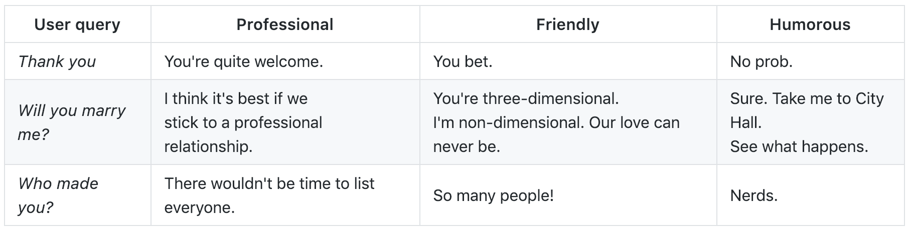

# Talking to my Bot

This lab will show you how to build a bot using the new Microsoft Bot Framework SDK V4, the new Speech unified service and other Cognitive Services. The lab scenario focuses on Contoso Restaurant, a fictional restaurant that wants their customers to be able to make reservations using an interactive bot. In order to accomplish this, customers will need to be able to query information using natural language, QnA Maker and speech cognitive services as Translator Speech, Custom Speech and Speech.

When designing your bot, it is important to take into consideration the [Microsoft's guidelines for responsibly building conversational AI](https://aischool.microsoft.com/en-us/conversational/learning-paths/responsible-conversational-ai/responsible-conversational-ai). Be mindful, as the developer it is your responsibility for how the bot interacts with the user and that you ensure a reliable and secure experience.

## Setup your environment

### A) Setup your Azure subscription

This lab **requires** an Azure subscription. If you delete the resources at the end of the session, total charges will be less than $1 so we strongly recommend using an existing subscription if available.

If you need a new Azure subscription, then there are a couple of options to get a free subscription:

1. The easiest way to sign up for an Azure subscription is with VS Dev Essentials and a personal Microsoft account (like @outlook.com). This does require a credit card; however, there is a spending limit in the subscription so it won't be charged unless you explicitly remove the limit.

    * Open Microsoft Edge and go to the [Microsoft VS Dev Essentials site](https://visualstudio.microsoft.com/dev-essentials/).
    * Click **Join or access now**.
    * Sign in using your personal Microsoft account.
    * If prompted, click Confirm to agree to the terms and conditions.
    * Find the Azure tile and click the **Activate** link.

1. Alternatively, if the above isn't suitable, you can sign up for a free Azure trial.

    * Open Microsoft Edge and go to the [free Azure trial page](https://azure.microsoft.com/en-us/free/).
    * Click **Start free**.
    * Sign in using your personal Microsoft account.

1. Complete the Azure sign up steps and wait for the subscription to be provisioned. This usually only takes a couple of minutes.

Please see the lab team if any of the above steps present any problems.

### B) Install Project Template in Visual Studio

Follow the next steps to install the *Bot Builder SDK V4 for Visual Studio* template, if you already have it you can skip this section.

1. We will use Visual Studio 2017 with Bot template to develop a bot. If you don't have Visual Studio you can download it from the following URL given below.

    * Download Visual Studio 2017 15.6.7 or newer (any edition) from https://www.visualstudio.com/downloads/.
    * Refer Visual Studio 2017 system requirement from https://www.visualstudio.com/en-us/productinfo/vs2017-system-requirements-vs.

1. Open Visual Studio and click on **Tools** from the menu.
1. Click on **Get Tools and Features**. Make sure your Visual Studio has the following workloads:

    * ASP.NET and web development
    * Azure development
    * .NET Core cross-platform development

    > **Note:** Install any of the missing workloads as they are required by the Bot Builder SDK v4.

1. Open **Microsoft Edge** and navigate to https://marketplace.visualstudio.com/items?itemName=BotBuilder.botbuilderv4.
1. Click **Download**.
1. When prompted, click **Open**.
1. Click **Modify** and complete the template installation.

### C) Download the lab materials

Follow the next steps to download the sample code provided for this lab, it includes a prebuilt React front-end that uses the *Bot Framework Web Chat* component and a Chat Bot based in the *Bot Builder SDK V4 for Visual Studio* template.

1. Click **Clone or download** from this repo.
1. You can clone the repo using git or click **Download ZIP** to directly download the code from your browser.
  > [!ALERT] Make sure to uncompress/clone your code into **Downloads/buildanintelligentbot**.

### D) Install Bot Framework Emulator

Follow the next steps to install the *Bot Framework Emulator V4*, if you already have it you can skip this section.

1. Open **Microsoft Edge** and navigate to https://github.com/Microsoft/BotFramework-Emulator/releases.
1. Download the `exe` file of the latest *4.x* version available.
1. When prompted, click **Open**.
1. Complete the installation.

### E) Create a Bot resource in Azure

The Azure Bot Service is an integrated offering for building and hosting bots. It pulls together the Microsoft Bot Framework for core bot functionality and Azure Web Apps for hosting. In this lab, we'll be using an Azure Web App to host our bot and use Direct Line Channel to integrate the Web Chat with the bot service.

1. Log into the [Azure Portal](https://portal.azure.com)(portal.azure.com).
1. Click **Create Resource [+]**  from the left menu and search for **Web App Bot**.
1. **Select** the first result and then click the **Create** button.
1. Provide the required information:

    * Bot name: `chatbot-<your initials>`
    * Create a new resource group with the name: `ttmb-lab-<your initials>`.
    * Location: `West US`
    * Pricing tier: `F0 (10K Premium Messages)`
    * App name: `chatbot-<your initials>`
    * Bot template: `Basic C#`

        > **Note:** This bot template includes Language Understanding and it will create a LUIS Application that we will use later in the lab.

    * LUIS App location: `West US`
    * Azure Storage: create a new one with the recommended name.
    * Application Insights Location: `West US 2`

1. Click on **App service plan/Location**.
1. Click **Create New**.
1. Provide the required information:

    * App Service plan name: `chatbot-<your initials>`
    * Location: `West US`

1. Click **OK** to save the new App service plan.
1. Click **Create** to deploy the service. This step might take a few moments.
1. Once the deployment is completed you will see a **Deployment succeeded** notification.
1. Go to **All Resources** in the left pane and **search** for the new resource (`chatbot-<your initials>`).
1. Click on the **Web App Bot** to open it.
1. Click on the **Test in Web Chat** option in the menu to test the new bot.
1. Type **Hello** into the built-in chat control, you should get a response from your bot.

## Quickly creating a basic bot

Let's create a basic bot using the SDK V4, we'll run it locally in Visual Studio 2017 using the Bot Framework Emulator.

### A) Create Project

1. Open **Visual Studio 2017** from the Start Menu.
1. Click **Create new project...**. You can also find this option in VS Menu: **File > New > Project**.
1. In the search box from the top right corner type: `bot`.
1. Select `Echo Bot (Bot Framework v4)`.
1. Provide a name for your new project: `MyBot`.
1. Click **Ok**.

    > [!ALERT] Do not name the project `EchoBot` as there will be conflicts with the EchoBot class in `Bots/EchoBot.cs`.
    > **Note:** The template has pre-installed the latest version of the new Bot Framework SDK.

### B) Debugging with Bot Framework Emulator

The bot emulator provides a convenient way to interact and debug your bot locally.

1. Open the `Bots/EchoBot.cs` file.
1. Put a **breakpoint** on line 18.
1. Run the app by clicking on the **IIS Express** button in Visual Studio (with the green play icon).

    > **Note:** A new web page with the Web Chat will be opened in your browser. Don't use this one yet as we'll configure it later.

1. Once the page has loaded in Microsoft Edge, **copy** the site host from the address bar to the clipboard (e.g. `http://localhost:XXXX`).

    > **Note:** We won't be using the web site chat control until later in the lab. Make sure you use the emulator until then!

1. **Open** the **Bot Framework Emulator** from the Start Menu.
1. Click **File** -> **New bot configuration**.
1. Paste the url that you copied from your browser, and add `/api/messages` at the end of it. It should look something like: `http://localhost:3978/api/messages`.
1. Click the **Save and Connect** button to connect to the local bot, and start a conversation.

    > **Note:** You will need to save the configuration to a file before; just select a location, enter the name and save.

1. **Type** `Hello` and press enter.
1. Return to **Visual Studio** and wait for the breakpoint to be hit.
1. **Mouse over** the `context.Activity.Text` variable to see your input message.
1. Press **Continue** in the toolbar.
1. **Remove** the breakpoint.
1. Go back to the emulator and see the response from the bot.
1. **Stop** debugging by clicking the stop button in Visual Studio's toolbar.

### C) Update Welcome message

Notice that when you start a conversation the bot is showing an initial message, let's update this welcome message to display it to the user at the beginning of the conversations:

1. Open the **Bots/EchoBot.cs** file and add the following import at the beginning of the file:

    ```cs
    using System.Linq;
    ```

1. Modify the `OnMembersAddedAsync` method, replace the text `Hello and Welcome!` with the following text:

    ```cs
    "Hi! I'm a restaurant assistant bot. I can add help you with your reservation."
    ```

1. Let's run the bot to see the welcome message.

    * Run the app by clicking on the **IIS Express** button in Visual Studio (with the green play icon).
    * Return to the **Bot Framework Emulator**.
    * Click the **Restart conversation** button to start a new conversation.
    * See the updated welcome message displayed at the beginning of the conversation.
    * **Stop** debugging by clicking the stop button in Visual Studio's toolbar.


## Adding the Language Understanding service to your bot

Language Understanding (LUIS) allows your application to understand what a person wants in their own words. LUIS uses machine learning to allow developers to build applications that can receive user input in natural language and extract meaning from it.

### A) Create a LUIS subscription

While LUIS has a standalone portal for building the model, it uses Azure for subscription management.

Create the LUIS resource in Azure:

1. Return to the Azure Portal (++portal.azure.com++).
1. Click **Create Resource [+]**  from the left menu and search for **Language Understanding**.
1. **Select** the first result and then click the **Create** button.
1. Provide the required information:

    * App name: `chatbot-luis-<your_initials>`.
    * Location: `West US`.
    * Pricing tier: `F0 (5 Calls per second, 10K Calls per month)`.
    * Use existing resource group: `ttmb-lab-<your initials>`.

1. Click **Create**. This step might take a few seconds.
1. Once the deployment is complete, you will see a **Deployment succeeded** notification.
1. Go to **All Resources** in the left pane and **search** for the new resource (`chatbot-luis-<your initials>`).
1. **Click** on the resource.
1. Go to the **Keys** page.
1. Copy the **Key 1** value into **Notepad**.

    > **Note:** We'll need this key later on.

### B) Import and extend the LUIS model

Before calling LUIS, we need to train it with the kinds of phrases we expect our users to use.

1. Login to the [LUIS portal](https://www.luis.ai).

    > **Note:** Use the same credentials as you used for logging into Azure.

2. If this is your first login in this portal, you will receive a welcome message. Follow the next steps access the LUIS dashboard:

    * **Scroll down** to the bottom of the welcome page.
    * Click **Create LUIS app**.
    * Select **United States** from the country list.
    * Check the **I agree** checkbox.
    * Click the **Continue** button.

3. From `My Apps`, look for the following app `chatbot-<your initials>`. You will see an existing Luis App (chatbot-<your initials>-<some random suffix>), this was generated by the **Web App Bot** deployment.
4. Click on the **Manage** option.
5. **Copy** the LUIS `Application ID` to Notepad.

    > **Note:** We'll need this app ID later on.

6. Click the **Versions** option.
7. Click on **Import version**.
8. Click on **Choose version file**.
9. **Select** the base model from `Downloads\buildanintelligentbot\resources\talk-to-my-bot.json`.
10. Click on the **Done** button.
11. **Wait** for the import to complete.
12. Click on the **Train** button and wait for it to finish.
13. Click the **Test** button to open the test panel.
14. **Type** `I need a dinner reservation` and press enter.

    > **Note:** It should return the `ReserveTable` intent.

15. Click the **Test** button in the top right to close the test panel.
16. Add a **new intent**:

    * Click on **Build**.
    * Click on **Intents**.
    * Click on **Create new intent**.
    * Type the new intent name: `TodaysSpecialty`
    * Click **Done**.

17. Add a new **utterance** by typing the following example in the textbox:

    * Type: `what is the specialty for today?`
    * Press **Enter**.

18. Add another new **utterance**:

    * Type: `what's the dish of the day?`
    * Press **Enter**.

19. **Test** your new intent:

    * Click on the **Train** button and wait for it to finish.
    * Click on **Test** button.
    * Type the following test utterance: `what's today's special?`
    * Press **Enter**.

        > **Note:** The test should return the `TodaysSpecialty` intent.

20. Click on the **Manage** option.
21. Click the **Keys and Endpoints** option.
22. **Copy** the `Authoring Key` to Notepad.

    > **Note:** We'll need this key later on.

23. Click on **+ Assign resource**. You might need to scroll down to find the option.

    * Select the only **tenant**.
    * Select your  **subscription**.
    * Select the **key** of your Luis resource.
    * Click on **Assign resource**.

24. Publish your application:

    * Click the **Publish** button.
    * Click on the **Publish** button next to the *Production* slot.
    * Wait for the process to finish.

### D) Install LUIS package

The Bot Builder SDK V4 provides a package to integrate LUIS with your bot. Follow the next steps to install the new package in the sample code.

Before we continue adding services to our bot, we'll open the sample code provided in order to have access to prebuilt services and models to speed up the lab.

1. Click **File** from Visual Studio menu.
1. Click **Open Project/Solution**.
1. Select the **solution file** `Downloads\buildanintelligentbot\src\TalkToMyBot.sln` and wait for it to load.
1. Right click the **Solution** and click `Restore NuGet Packages`.

Now let's install the LUIS package from NuGet:

1. Right click on the `ChatBot` project and click **Manage NuGet Packages**.
1. Select the **Browse** tab and search for `Microsoft.Bot.Builder.AI.Luis`.
1. Click on the NuGet package, select the version `4.4` and click **Install**.

### E) Add the LUIS Recognizer to your bot

Like all of the Cognitive Services, LUIS is accessible via a RESTful endpoint. However, the Bot Builder SDK has an inbuilt middleware component we can use to simplify this integration. This transparently calls LUIS before invoking our code, allowing our code to focus on processing the user's intent rather than natural language.

1. In **Visual Studio**, **open** the `appsettings.json` file.
1. Update the following LUIS configuration values:

  * Replace `<your_luis_app_id>` and `<your_luis_api_key>` with the values you captured in Notepad earlier from Luis portal.

1. **Open** the `Startup.cs` file.
1. **Add** the following namespace at the top of the file:

    ```cs
    using Microsoft.Bot.Builder.AI.Luis;
    ```

1. **Find** the comment `// create luis recognizer` around line 67 and replace it with the following code snippet:

    ```cs
    var luisApplication = new LuisApplication(
        Configuration["LuisAppId"],
        Configuration["LuisAPIKey"],
        "https://" + Configuration["LuisAPIHostName"]);
    services.AddSingleton(new LuisRecognizer(luisApplication));
    ```

### F) Adjust your Bot to process LUIS results

Modify the Bot code to handle the results from LUIS.

1. Open `EchoBot.cs`.
1. **Add** the following namespace at the top of the file:

    ```cs
    using Microsoft.Bot.Builder.AI.Luis;
    ```

1. **Find** the comment `// Add Luis Recognizer` and replace it with the following line:

    ```cs
    protected LuisRecognizer _luis;
    ```

1. **Replace** the constructor header to be:

    ```cs
    public EchoBot(EchoBotAccessors accessors, IOptions<MySettings> config, LuisRecognizer luisRecognizer)
    ```

1. **Find** the comment `// Initialize the LUIS recognizer` and replace it with the following line:

    ```cs
    _luis = luisRecognizer;
    ```

1. **Find** the comment `// Handle LUIS intents recognition` and replace it with the following code snippet:

    ```cs
    // Perform a call to LUIS to retrieve results for the current activity message.
    var luisResults = await _luis.RecognizeAsync(turnContext, cancellationToken).ConfigureAwait(false);
    var topScoringIntent = luisResults?.GetTopScoringIntent();
    var topIntent = topScoringIntent.Value.score > 0.5 ? topScoringIntent.Value.intent : string.Empty;

    // Your code goes here
    ```

    > **Note:** The first step with LUIS is to extract the *intent* from the context. This is populated by the recognizer.

1. **Replace** the recently added line `// Your code goes here` with the following code:

    ```cs
    switch (topIntent)
    {
        case "TodaysSpecialty":
            await turnContext.SendActivityAsync($"For today we have the following options: {string.Join(", ", BotConstants.Specialties)}");
            break;
        default:
            await turnContext.SendActivityAsync("Sorry, I didn't understand that.");
            break;
    }
    ```

    > **Note:** This switch will send the user's message to the right handler based on the LUIS intent name.

### G) Test LUIS configuration

Let's run the bot to see LUIS in action.

1. Run the app by clicking on the **IIS Express** button in Visual Studio (with the green play icon).
1. Once the page has loaded in Microsoft Edge, **copy** the site host from the address bar to the clipboard (e.g. `http://localhost:XXXX`).
1. Return to the **Bot Framework Emulator**.
1. Click **File** -> **New Bot Configuration**.
1. Paste the url that you copied from your browser, and add `/api/messages` at the end of it. It should look something like: `http://localhost:3978/api/messages`.

    > **Note:** The port might not be the same, but don't worry.

1. Click the **Save and connect** button.
1. Save the configuration to a file and continue to start a conversation.
1. **Type** `what is the specialty for today?` and press enter.
1. See the response, LUIS is processing our input and the bot can handle it accordingly.
1. **Stop** debugging by clicking the stop button in VS toolbar.

## Adding advanced conversational features to your bot

### A) Add a visual response to your bot: Carousel

Bots are capable of interacting with users through more than just text-based chat. *TodaysSpecialties* intent allows customers to review the different options in the menu for today's recommendations. Currently, this method is returning the options as a simple text. Let's modify it and return a carousel.

1. Open **EchoBot.cs**.
1. **Add** the following method to the class around line 54:

    ```cs
    private async Task TodaysSpecialtiesHandlerAsync(ITurnContext context)
    {
        var actions = new[]
        {
            new CardAction(type: ActionTypes.ShowImage, title: "Carbonara", value: "Carbonara", image: $"{BotConstants.Site}/carbonara.jpg"),
            new CardAction(type: ActionTypes.ShowImage, title: "Pizza", value: "Pizza", image: $"{BotConstants.Site}/pizza.jpg"),
            new CardAction(type: ActionTypes.ShowImage, title: "Lasagna", value: "Lasagna", image: $"{BotConstants.Site}/lasagna.jpg"),
        };

        var cards = actions
          .Select(x => new HeroCard
          {
              Images = new List<CardImage> { new CardImage(x.Image) },
              Buttons = new List<CardAction> { x },
          }.ToAttachment())
          .ToList();
        var activity = (Activity)MessageFactory.Carousel(cards, "For today we have:");

        await context.SendActivityAsync(activity);
    }
    ```

1. Modify the `OnTurnAsync` method, replace this line

    ```cs
    await turnContext.SendActivityAsync($"For today we have the following options: {string.Join(", ", BotConstants.Specialties)}");
    ```

    with

    ```cs
    await TodaysSpecialtiesHandlerAsync(turnContext);
    ```

### B) Test the visual response

Let's run the bot to see how the bot displays the response using an advanced card.

1. Run the app by clicking on the **IIS Express** button in Visual Studio (with the green play icon).
1. Open the `Models/BotConstants.cs` file.
1. Check the `Site` constant with the URI of the site, if it's different than the URI in the browser stop the app and update this constant with the right port and run the app again.
1. Return to the **Bot Framework Emulator**.
1. Click the **Restart conversation** button to start a new conversation.
1. Type `What is today's specialty?` and press **enter**.
1. The bot will display a set of food recommendations using images in a Carousel.
1. **Stop** debugging by clicking the stop button in VS toolbar.

### C) Install & Setup Dialogs package

The *Dialogs* package from NuGet allows to build Dialog sets that can be used to setup conversations as a sequence of steps.

1. Right click on the `ChatBot` project and click **Manage NuGet Packages**.
1. Select the **Browse** tab and search for `Microsoft.Bot.Builder.Dialogs`.
1. Click on the NuGet package, select version `4.4` and click **Install**.
1. Finish the installation process.

Configure the Dialog state:
1. Open `EchoBotAccessors.cs`.
1. **Add** the following namespace at the top of the file:

    ```cs
    using Microsoft.Bot.Builder.Dialogs;
    ```

1. **Add** the following property at the end of the class:

    ```cs
    public IStatePropertyAccessor<DialogState> ConversationDialogState { get; set; }
    ```

1. **Open** the `ReservationDialog.cs` file inside the `Dialogs` folder.
1. **Add** the following namespace at the top of the file:

    ```cs
    using Microsoft.Bot.Builder.Dialogs;
    ```

1. **Update** the class definition to be:

    ```cs
    public class ReservationDialog : ComponentDialog
    ```

1. **Update** the constructor definition to be:

    ```cs
    public ReservationDialog(
        IStatePropertyAccessor<ReservationData> userProfileStateAccessor,
        TextToSpeechService ttsService)
        : base(nameof(ReservationDialog))
    ```

1. **Add** the following method:

    ```cs
    private async Task<DialogTurnResult> InitializeStateStepAsync(WaterfallStepContext stepContext, CancellationToken cancellationToken)
    {
        var state = await UserProfileAccessor.GetAsync(stepContext.Context, () => null);
        if (state == null)
        {
            var reservationDataOpt = stepContext.Options as ReservationData;
            if (reservationDataOpt != null)
            {
                await UserProfileAccessor.SetAsync(stepContext.Context, reservationDataOpt);
            }
            else
            {
                await UserProfileAccessor.SetAsync(stepContext.Context, new ReservationData());
            }
        }

        return await stepContext.NextAsync();
    }
    ```

    > **Note:*** This method will be the first step of the dialog and is in charge of initialize the state if it's not already.

1. **Open** `Startup.cs`.
1. **Add** the following namespace at the top of the file:

    ```cs
    using Microsoft.Bot.Builder.Dialogs;
    ```

1. Find the comment `Initialize Dialog State` and replace that line with the following code snippet:

    ```cs
    ConversationDialogState = conversationState.CreateProperty<DialogState>("DialogState"),
    ReservationState = userState.CreateProperty<ReservationData>("ReservationState"),
    ```

### D) Setup the conversation flow

Now that our bot supports LUIS, we'll finish the implementation by using the SDK to query the reservation date, confirm the reservation, and ask any clarifying questions. And we'll skip questions if the user has already provided the information as part of their initial utterance.

1. Open **EchoBot.cs**.
1. **Add** the following namespace at the top of the file:

    ```cs
    using Microsoft.Bot.Builder.Dialogs;
    ```

1. **Find** the comment `// Add Dialogs set` and replace it with the following line:

    ```cs
    private readonly DialogSet _dialogs;
    ```

1. **Find** the comment `// Initialize the dialogs` and replace it with the following line:

    ```cs
    _dialogs = new DialogSet(_accessors.ConversationDialogState);
    ```

1. **Find** the comment `// Register the dialog` and replace it with the following line:

    ```cs
    _dialogs.Add(new ReservationDialog(_accessors.ReservationState, null));
    ```

1. **Modify** the `OnTurnAsync` method by adding the following code snippet **before** the line `if (!turnContext.Responded)`:

    ```cs
    var dialogContext = await _dialogs.CreateContextAsync(turnContext, cancellationToken);
    var dialogResult = await dialogContext.ContinueDialogAsync(cancellationToken);
    ```

1. **Replace** the content of `if (!turnContext.Responded)` with the following code snippet:

    ```cs
    switch (dialogResult.Status)
    {
        case DialogTurnStatus.Empty:
            // Your code goes here

            break;
        case DialogTurnStatus.Waiting:
            // The active dialog is waiting for a response from the user, so do nothing.
            break;
        case DialogTurnStatus.Complete:
            await dialogContext.EndDialogAsync();
            break;
        default:
            await dialogContext.CancelAllDialogsAsync();
            break;
    }
    ```

    > **Note:** This allows to handle the result depending on the dialog status.

1. **Replace** the recently added line `// Your code goes here` with the following code:

    ```cs
    // Check LUIS model
    var luisResults = await _luis.RecognizeAsync(turnContext, cancellationToken).ConfigureAwait(false);
    var topScoringIntent = luisResults?.GetTopScoringIntent();
    var topIntent = topScoringIntent.Value.score > 0.5 ? topScoringIntent.Value.intent : string.Empty;
    switch (topIntent)
    {
        case "TodaysSpecialty":
            await TodaysSpecialtiesHandlerAsync(turnContext);
            break;
        case "ReserveTable":
            var amountPeople = luisResults.Entities["AmountPeople"] != null ? (string)luisResults.Entities["AmountPeople"]?.First : null;
            var time = GetTimeValueFromResult(luisResults);
            await ReservationHandlerAsync(dialogContext, amountPeople, time, cancellationToken);
            break;
        default:
            await turnContext.SendActivityAsync("Sorry, I didn't understand that.");
            break;
    }
    ```

    > **Note:** The missed methods will be added later.

1. **Add** the following method at the end of the class to extract the reservation date:

    ```cs
    private string GetTimeValueFromResult(RecognizerResult result)
    {
        var timex = (string)result.Entities["datetime"]?.First["timex"].First;
        if (timex != null)
        {
            timex = timex.Contains(":") ? timex : $"{timex}:00";
            return DateTime.Parse(timex).ToString("MMMM dd \\a\\t HH:mm tt");
        }

        return null;
    }
    ```

    > **Note:** The time returned by Luis contains the datetime as a string in a property called 'timex'.

1. **Add** the `ReservationHandlerAsync` method to start the conversation flow for the table reservation intent:

    ```cs
    private async Task ReservationHandlerAsync(DialogContext dialogContext, string amountPeople, string time, CancellationToken cancellationToken)
    {
        var state = await _accessors.ReservationState.GetAsync(dialogContext.Context, () => new ReservationData(), cancellationToken);
        state.AmountPeople = amountPeople;
        state.Time = time;
        await dialogContext.BeginDialogAsync(nameof(ReservationDialog));
    }
    ```

    > **Note:** The method invokes the `ReservationDialog` pushed in the constructor.

1. Put a breakpoint on the `await dialogContext.BeginDialogAsync(GatherInfo);` line in the `ReservationHandlerAsync`.
1. **Find** the comment `// Save states in the accessor` in the `OnTurnAsync` method and add the following code snippet after that:

    ```cs
    // Get the conversation state from the turn context.
    var state = await _accessors.ReservationState.GetAsync(turnContext, () => new ReservationData());

    // Set the property using the accessor.
    await _accessors.ReservationState.SetAsync(turnContext, state);

    // Save the new state into the conversation state.
    await _accessors.ConversationState.SaveChangesAsync(turnContext);
    await _accessors.UserState.SaveChangesAsync(turnContext);
    ```

1. **Open** the `ReservationDialog.cs` file inside the `Dialogs` folder.
1. **Find** the comment `// Add control flow dialogs` and add after the following code snippet:

    ```cs
    AddDialog(new WaterfallDialog(ProfileDialog, waterfallSteps));
    AddDialog(new TextPrompt(TimePrompt));
    AddDialog(new TextPrompt(AmountPeoplePrompt, AmountPeopleValidatorAsync));
    AddDialog(new TextPrompt(NamePrompt));
    AddDialog(new ConfirmPrompt(ConfirmationPrompt));
    ```

    > **Note:** This will setup the conversation flow passing the Luis results between the steps.

1. **Add** the following method to request the reservation date if it wasn't provided in the initial utterance:

    ```cs
    private async Task<DialogTurnResult> TimeStepAsync(WaterfallStepContext stepContext, CancellationToken cancellationToken)
    {
        var state = await UserProfileAccessor.GetAsync(stepContext.Context);

        if (string.IsNullOrEmpty(state.Time))
        {
            var msg = "When do you need the reservation?";
            var opts = new PromptOptions
            {
                Prompt = new Activity
                {
                    Type = ActivityTypes.Message,
                    Text = msg,
                    // Add the message to speak
                },
            };
            return await stepContext.PromptAsync(TimePrompt, opts);
        }
        else
        {
            return await stepContext.NextAsync();
        }
    }
    ```

1. **Add** the following method to request the amount of people in the reservation if it wasn't provided in the initial utterance:

    ```cs
    private async Task<DialogTurnResult> AmountPeopleStepAsync(WaterfallStepContext stepContext, CancellationToken cancellationToken)
    {
        var state = await UserProfileAccessor.GetAsync(stepContext.Context);

        if (stepContext.Result != null)
        {
            var time = stepContext.Result as string;
            state.Time = time;
        }

        if (state.AmountPeople == null)
        {
            var msg = "How many people will you need the reservation for?";
            var opts = new PromptOptions
            {
                Prompt = new Activity
                {
                    Type = ActivityTypes.Message,
                    Text = msg,
                    // Add the message to speak
                },
            };
            return await stepContext.PromptAsync(AmountPeoplePrompt, opts);
        }
        else
        {
            return await stepContext.NextAsync();
        }
    }
    ```

    > **Note:** Notice how we extract the response from the previous step and update the state in each step.

1. **Add** the following method to request the name on the reservation:

    ```cs
    private async Task<DialogTurnResult> NameStepAsync(WaterfallStepContext stepContext, CancellationToken cancellationToken)
    {
        var state = await UserProfileAccessor.GetAsync(stepContext.Context);

        if (stepContext.Result != null)
        {
            state.AmountPeople = stepContext.Result as string;
        }

        if (state.FullName == null)
        {
            var msg = "And the name on the reservation?";
            var opts = new PromptOptions
            {
                Prompt = new Activity
                {
                    Type = ActivityTypes.Message,
                    Text = msg,
                    // Add the message to speak
                },
            };
            return await stepContext.PromptAsync(NamePrompt, opts);
        }
        else
        {
            return await stepContext.NextAsync();
        }
    }
    ```

1. **Add** the following methods to request a confirmation and finalize the reservation:

    ```cs
    private async Task<DialogTurnResult> ConfirmationStepAsync(WaterfallStepContext stepContext, CancellationToken cancellationToken)
    {
        var state = await UserProfileAccessor.GetAsync(stepContext.Context);

        if (stepContext.Result != null)
        {
            state.FullName = stepContext.Result as string;
        }

        if (state.Confirmed == null)
        {
            var msg = $"Ok. Let me confirm the information: This is a reservation for {state.Time} for {state.AmountPeople} people. Is that correct?";
            var retryMsg = "Please confirm, say 'yes' or 'no' or something like that.";

            var opts = new PromptOptions
            {
                Prompt = new Activity
                {
                    Type = ActivityTypes.Message,
                    Text = msg,
                    // Add the message to speak
                },
                RetryPrompt = new Activity
                {
                    Type = ActivityTypes.Message,
                    Text = retryMsg,
                    // Add the retry message to speak
                },
            };
            return await stepContext.PromptAsync(ConfirmationPrompt, opts);
        }
        else
        {
            return await stepContext.NextAsync();
        }
    }
    ```

1. **Add** the following method to verify the confirmation response and finish the flow.

    ```cs
    private async Task<DialogTurnResult> FinalStepAsync(WaterfallStepContext stepContext, CancellationToken cancellationToken)
    {
        var state = await UserProfileAccessor.GetAsync(stepContext.Context);

        if (stepContext.Result != null)
        {
            var confirmation = (bool)stepContext.Result;
            string msg = null;
            if (confirmation)
            {
                msg = $"Great, we will be expecting you this {state.Time}. Thanks for your reservation {state.FirstName}!";
            }
            else
            {
                msg = "Thanks for using the Contoso Assistance. See you soon!";
            }

            await stepContext.Context.SendActivityAsync(msg);
        }

        return await stepContext.EndDialogAsync();
    }
    ```

1. **Add** the following method to validate that the amount of people specified is a number:

    ```cs
    private async Task<bool> AmountPeopleValidatorAsync(PromptValidatorContext<string> promptContext, CancellationToken cancellationToken)
    {
        var value = promptContext.Recognized.Value?.Trim() ?? string.Empty;

        if (!int.TryParse(value, out int numberPeople))
        {
            var msg = "The amount of people should be a number.";
            await promptContext.Context.SendActivityAsync(msg)
              .ConfigureAwait(false);
            return false;
        }
        else
        {
            promptContext.Recognized.Value = value;
            return true;
        }
    }
    ```

1. **Find** the `// Add control flow steps` comment and add after the following code snippet:

    ```cs
    var waterfallSteps = new WaterfallStep[]
    {
        InitializeStateStepAsync,
        TimeStepAsync,
        AmountPeopleStepAsync,
        NameStepAsync,
        ConfirmationStepAsync,
        FinalStepAsync,
    };
    ```

### E) Test the conversation flow

Let's run the bot to see how LUIS processes the new conversation flow.

1. Run the app by clicking on the **IIS Express** button in Visual Studio (with the green play icon).
2. Return to the **Bot Framework Emulator**.
3. Click the **Restart conversation** button to start a new conversation.
4. Type `I need a dinner reservation for tomorrow at 7:30 pm` and press **enter**.
5. Return to **Visual Studio** and wait for the breakpoint to be hit.
6. **Mouse over** the `amountPeople` and `time` variables to inspect their content.

    > **Note:** Only the time will have a value, as this is the only piece of information provided in our initial utterance.

7. Press **Continue** in the toolbar.
8. Return to the **Bot Framework Emulator**.
9. The bot will request the amount of people in the reservation. Type a `abc` and press **enter**.

    > **Note:** Notice the validation working, in this case the bot will request the amount of people again.

10. Type a `2` and press **enter**.
11. The bot will request the name of the reservation. Type a `Jane Olson` and press **enter**.
12. The bot will request a confirmation. Type `yes` and press **enter**.

    > **Note:** At this point the conversation flow will be finished.

13. **Stop** debugging by clicking the stop button in VS toolbar.
14. **Remove** the breakpoint previously added.


## Adding Knowledge to your Bot with QnA Maker

### A) Set up QnA Maker

While the Bot Builder SDK makes building sophisticated dialog flows easy, this won't always scale well. QnA Maker can intelligently build a knowledge base of question and answer pairs and help respond to common user questions.

Create your QnA Maker Azure resource:

1. Return to the [Azure Portal](https://portal.azure.com)(portal.azure.com).
1. Click **Create Resource [+]**  from the left menu and search for **QnA Maker**.
1. **Select** the first result and then click the **Create** button.
1. Provide the required information:

    * Name: `chatbot-qna-<your initials>`
    * Management Pricing tier: `F0 (3 Calls per second)`
    * Use existing resource group: `ttmb-lab-<your initials>`
    * Search pricing tier: `F (3 Indexes, 10K Documents)`
    * Search Location: `West US`
    * App name: `build-qna-<your initials>`
    * Website Location: `West US`
    * Application Insights Location: `West US 2`

1. Click **Create** to deploy the service. This step might take a few moments.
1. Once the deployment is complete, you will see a **Deployment succeeded** notification.
1. Go to **All Resources** in the left pane and **search** for the new resource (`chatbot-qna-<your initials>`).
1. **Click** on the resource.
1. Go to the **Keys** page.
1. Copy the **Key 1** value into **Notepad**.

    > **Note:** We'll need this key later on.

Setup your QnA Maker instance:

1. Log into the [QnA Maker portal](https://qnamaker.ai)(qnamaker.ai) using your **Azure** credentials.
2. Create a knowledge base:

    * Click on **Create a knowledge base**.
    * Scroll down to **Step 2**: Connect your QnA service to your KB.
    * Select the previously created Azure service.
    * Scroll down to **Step 3**: Name your KB.
    * Enter the name of the KB: `qna-<your initials>`
    * Scroll down to **Step 4**: Populate your KB.
    * Click **Add File** and select the knowledge base file provided: `resources/qna-ttmb-KB.tsv`

3. Click **Create your KB** and wait for the new instance to load.

    > **Note:** You will be redirected to the QnA dashboard and it will display the questions in you knowledge base, these are populated from the previously loaded file

4. Click **Save and train**. This should take a minute.
5. Click **Publish** to start the publishing process and then **Publish** again to confirm.
6. From the sample HTTP request, sopy the following values to a Notepad:

    * **Host** url.
    * **EndpointKey** from the `Authorization` header
    * **KnowledgeBaseId** from the POST Uri: `knowledgebases/<knowledgeBaseId>/generateAnswer`

### C) Install QnA Maker package

1. In Visual Studio, right click on the `ChatBot` project and click **Manage NuGet Packages**.
1. Select the Browse tab and search for `Microsoft.Bot.Builder.AI.QnA`.
1. Select the NuGet package, select version `4.4` and click **Install**.

### B) Add QnA Maker to the bot

The Bot Builder SDK has native support for adding QnA Maker to your bot.

1. Return to **Visual Studio**.
1. Open **appsettings.json** and add the QnA Maker settings:

    ```
    "QnAKbId": "<your knowledge base id>",
    "QnAEndpointKey": "<your qna maker subscription key>",
    "QnAHostname": "<your qna maker url>"
    ```

    > **Note:** Make sure you update the host, endpoint key, and knowledge base ID.

1. Open **Startup.cs**.
1. **Add** the following namespaces at the top of the file:

    ```cs
    using Microsoft.Bot.Builder.AI.QnA;
    ```

1. Look for the line `Add QnA Maker here`  **add** the following code before it:

    ```cs
    // We add the the QnA service to the connected services.
    // Create and register a QnA service and knowledgebase
    services.AddSingleton(sp =>
    {
        return new QnAMaker(
            new QnAMakerEndpoint
            {
                EndpointKey = Configuration["QnAEndpointKey"],
                Host = Configuration["QnAHostname"],
                KnowledgeBaseId = Configuration["QnAKbId"],
            },
            new QnAMakerOptions
            {
                ScoreThreshold = 0.9f,
                Top = 1,
            });
    });
    ```

1. Open **EchoBot.cs**.
1. **Add** the following import at the top of the class:

    ```cs
    using Microsoft.Bot.Builder.AI.QnA;
    ```

1. **Find** the comment `// Add QnAMaker` and add after that the following code snippet:

    ```cs
    private QnAMaker QnA { get; } = null;
    ```

1. Change the definition of the constructor from:

    ```cs
    public EchoBot(EchoBotAccessors accessors, IOptions<MySettings> config, LuisRecognizer luisRecognizer)
    ```

  to

    ```cs
    public EchoBot(EchoBotAccessors accessors, IOptions<MySettings> config, LuisRecognizer luisRecognizer, QnAMaker qna)
    ```

1. **Find** the line `_accessors = accessors ?? throw new ArgumentNullException(nameof(accessors));` and add the following line after:

  ```cs
  QnA = qna ?? throw new ArgumentNullException(nameof(qna));
  ```

1. In the method `OnTurnAsync` find the line `await turnContext.SendActivityAsync("Sorry, I didn't understand that.");` and replace it with the following code snippet:

    ```cs
    var answers = await this.QnA.GetAnswersAsync(turnContext);

    if (answers is null || answers.Count() == 0)
    {
        await turnContext.SendActivityAsync("Sorry, I didn't understand that.");
    }
    else if (answers.Any())
    {
        // If the service produced one or more answers, send the first one.
        await turnContext.SendActivityAsync(answers[0].Answer);
    }
    ```

### D) Test QnA Maker in Bot Emulator

1. Run the app by clicking on the **IIS Express** button in Visual Studio (with the green play icon).
1. Return to the **Bot Framework Emulator**.
1. Click the **Restart conversation** button to start a new conversation.
1. **Type** `where are you located?` and press **enter**.
1. Check the response from the Bot using QnA Maker now.
1. Return to **Visual Studio** and **stop** debugging by clicking the stop button in the toolbar.

## Implementing Personality Chat

Let's make our bot more user friendly by adding the Personality Chat. This cognitive service enhances the bot's conversational capabilities, by allowing to handle small talk using a chosen personality.

### A) Add Project Personality Chat to the bot

The Bot Builder SDK enables chitchat capabilities by using the PersonalityChat middleware. The code provided already includes the Personality Chat NuGet package `Microsoft.Bot.Builder.PersonalityChat`, all we have to do is configure the Middleware.

1. Return to **Visual Studio**.
1. Open **Startup.cs**.
1. **Find** the comment `// Add the personality chat middleware` and add after the following code snippet:

    ```cs
    var personalityChatOptions = new PersonalityChatMiddlewareOptions(
      respondOnlyIfChat: true,
      scoreThreshold: 0.5F,
      botPersona: PersonalityChatPersona.Humorous);
    services.AddSingleton(new PersonalityChatMiddleware(personalityChatOptions));
    ```

    > **Note:** For this sample we will use the default "Humorous" personality, other options are: Professional and Friendly (default).

1. Open **AdapterWithErrorHandler.cs**.
1. Replace the constructor header to be:

    ```cs
    public AdapterWithErrorHandler(ICredentialProvider credentialProvider, ILogger<BotFrameworkHttpAdapter> logger, PersonalityChatMiddleware personalityChatMiddleware, ConversationState conversationState = null)
            : base(credentialProvider)
    ```

1. Find the comment `// Use personality chat middleware` and add the following code snippet:

    ```cs
    if (personalityChatMiddleware == null)
    {
        throw new NullReferenceException(nameof(personalityChatMiddleware));
    }

    Use(personalityChatMiddleware);
    ```

### B) Test Personality Chat in Bot Emulator

1. Run the app by clicking on the **IIS Express** button in Visual Studio (with the green play icon).
1. Return to the **Bot Framework Emulator**.
1. Click the **Restart conversation** button to start a new conversation.
1. **Type** `how old are you?` and press **enter**. See the response from your bot.
1. Return to **Visual Studio** and **stop** debugging by clicking the stop button in the toolbar.
1. Try changing the personality from **Startup.cs** to be something like `botPersona: PersonalityChatPersona.Professional` and see how the bot response changes accordingly to fit the selected personality.

    > **Note:** Review the image below to see which utterances you can try and what output to expect in each case.

      

## Adding Speech support (Text-to-Speech and Speech-to-Text)

In this section we will enable speech in Web Chat to recognize speech and send the transcript to the bot. We will also use Text to Speech from Speech service to generate SSML and send audio back from the Web Chat.

### A) Create a Speech subscription

1. Return to the [Azure Portal](https://portal.azure.com)(portal.azure.com).
1. Click **Create Resource [+]**  from the left menu and search for **Speech**.
1. **Select** the *Speech* result and then click the **Create** button.
1. Provide the required information:

    * App name: `speech-<your_initials>`.
    * Location: `East US`.
    * Pricing tier: `S0`.
    * Use existing resource group: `ttmb-lab-<your initials>`.

    > **Note:** Make sure to select `East US` for the location as the Neural voice we will use ahead on the lab is available only in a limited set of regions. [Here](https://docs.microsoft.com/en-us/azure/cognitive-services/speech-service/regions#neural-voices) you can find more information about the neural voices regions.

1. Click **Create**. This step might take a few seconds.
1. Once the deployment is complete, you will see a **Deployment succeeded** notification.
1. Go to **All Resources** in the left pane and **search** for the new resource (`speech-<your initials>`).
1. **Click** on the resource.
1. Go to the **Keys** page.
1. Copy the **Key 1** value into **Notepad**.

    > **Note:** We'll need this key later on.

### B) Set Up Web Chat

Speech is available as a component called `SpeechRecognizer` in the Web Chat control. The Speech Recognizer generates a transcript from an audio, this will allow us to get the text from the user speech and then send that text to the bot. Before we can set up the speech capabilities, we need to configure the web chat control.

1. From the **Azure Portal**, click on the **Channels** option of your **Web App Bot**.
1. Under **Add a featured channel**, select **Configure Direct Line Channel**.
1. In the **Secret Keys** section, click the **Show** toggle button to display the password.
1. **Copy** the first password to clipboard.
1. **Return** to Visual Studio.
1. **Open** the `default.html` file in the `wwwroot` folder.

    > **Note:** The web chat control has already been imported into the page, we just need to configure it. This Web Chat was modified to use the Speech websockets instead of the general Bing service.

1. **Replace** the `direct-line-secret` from line 181 with the value on clipboard.
1. **Replace** the Speech Subscription key `<your-speech-subscription-key>` from line 97 with the value previously obtained from Azure.

### C) Add Text to Speech to bot

For this scenario we will generate the audio SSML in the backend (our bot code). We'll use one of the pre set neural voices and play the audio by using the Speech synthesizer component from the Web Chat. The idea of use a neural voice is to create the interacions in a more natural way as the sinthethized speech of a neural voice is very close of a human recording. The synthesizer was adjusted to use the Speech websockets endpoint, which in the background uses the regular Bing text-to-speech feature.

1. Open **EchoBot.cs**.
1. **Find** the comment `// Add text to speech service` and replace it with:

    ```cs
    private readonly TextToSpeechService _ttsService;
    ```

1. **Find** the comment `// Initialize the TTSS` and replace it with:

    ```cs
    _ttsService = new TextToSpeechService(config.Value.VoiceFontName, config.Value.VoiceFontLanguage);
    ```

    > **Note:** The `TextToSpeechService` selects the `JessaNeural` voice for the `en-US` language, [here](https://docs.microsoft.com/en-us/azure/cognitive-services/speech-service/language-support#neural-voices-preview) you can find more information about Neural voices.

1. **Find** the line in the constructor `_dialogs.Add(new ReservationDialog(_accessors.ReservationState, null));` and replace the `null` at the end with `_ttsService` to include the service to the dialog.
1. **Modify** the *OnTurnAsync* method. Look for the welcome message `"Hi! I'm a restaurant assistant bot. I can help you with your reservation.` and **replace** the next line (`await turnContext.SendActivityAsync(msg);`) to include the audio SSML in the response:

    ```cs
    await turnContext.SendActivityAsync(msg, _ttsService.GenerateSsml(msg, BotConstants.EnglishLanguage));
    ```

1. **Open** the `ReservationDialog` in the `Dialogs` folder.
1. **Find** the `// Add the message to speak` comment in the `TimeStepAsync` method and replace it with the following line:

    ```cs
    Speak = _ttsService.GenerateSsml(msg, BotConstants.EnglishLanguage),
    ```

    > **Note:** Notice that we only modified the **Speak** option and set the SSML to the response activity. As an alternative we could just send the message and the Bot Framework Web Chat will generate the SSML for you, but for this lab we will send the SSML from the backend.

1. Repeat the previous step to add the speak property in the `AmountPeopleStepAsync` and `NameStepAsync` methods.
1. **Modify** the `ConfirmationStepAsync` method. Replace the `opts` variable with the following code snippet:

    ```cs
    var opts = new PromptOptions
    {
        Prompt = new Activity
        {
            Type = ActivityTypes.Message,
            Text = msg,
            Speak = _ttsService.GenerateSsml(msg, BotConstants.EnglishLanguage),
        },
        RetryPrompt = new Activity
        {
            Type = ActivityTypes.Message,
            Text = retryMsg,
            Speak = _ttsService.GenerateSsml(msg, BotConstants.EnglishLanguage),
        },
    };
    ```

1. **Modify** the `FinalStepAsync` method. Replace the `await stepContext.Context.SendActivityAsync(msg);` line with the following code:

    ```cs
    await stepContext.Context.SendActivityAsync(msg, _ttsService.GenerateSsml(msg, BotConstants.EnglishLanguage));
    ```

1. **Modify** the `AmountPeopleValidatorAsync` method. Replace the line `await promptContext.Context.SendActivityAsync(msg)` with the following code:

    ```cs
    await promptContext.Context.SendActivityAsync(msg, _ttsService.GenerateSsml(msg, BotConstants.EnglishLanguage))
    ```

### D) Deploy to Azure from Visual Studio

For the purposes of our lab, we'll be deploying directly from Visual Studio.

1. **Return** to the [Azure Portal](https://portal.azure.com)(portal.azure.com).
1. **Search** for the `Web App Bot` resource in your group.
1. Click the `Configuration` option of the menu in the left under the `App Service Settings` category.
1. Click the `Edit` icon for the settings `MicrosoftAppId` and `MicrosoftAppPassword` and copy the values for both in Notepad.
1. Delete all the following settings if they are set up:

    * LuisAPIHostName
    * LuisAPIKey
    * LuisAppId

    > **Note:** This is because we will use the settings from the project appsettings file.

1. If you delete at least one of the settings, click the `Save` button at the top.
1. **Return** to **Visual Studio**.
1. **Open** the `appsettings.json` file.
1. **Replace** the values of `MicrosoftAppId` and `MicrosoftAppPassword` with the values you got from Azure.
1. Click on the current connected account in the top right corner of **Visual Studio**.
1. Click on **Account Settings...**.
1. Click on the **Sign out** button.
1. Click on the **Sign in** button.
1. **Login** with the same credentials as you used for **Azure**.

    > **Note:** This will connect Visual Studio to your Azure subscription.

1. Click **Close**.
1. **Right-click** the `ChatBot` project.
1. Click **Publish**.
1. Mark the option `Select Existing`.
1. Click **Publish**.
1. Select the bot **Web App** previously created under the group **ttmb-lab-<your initials>**.
1. Click **OK** and wait for the deployment to complete. This step might take a few minutes.

### E) Test in Web Chat

1. Open your chat bot in a browser: `https://chatbot-<your initials>.azurewebsites.net/`.
1. Click on the **Speech** option.

    > **Note:** If something is not working make sure that you are using a secure connection by using `https://` in your URL.

1. Click the microphone icon once and say `I need a table reservation`.
1. Wait for the bot to reply, you should get an audio response back.
1. Finish the conversation flow using audio.

## Adding Custom Speech Support

This section will show you how to get started using the Custom Speech Service to improve the accuracy of speech-to-text transcription in your application. We'll use a Language Model to improve the output of some food domain-specific language.

### A) Connect to a Speech subscription

In order to compare the performance of the custom speech service, we'll create a custom speech model to process more specific language. This requires link your speech subscription from the CRIS Portal.

1. Log into the [CRIS Dashboard](https://cris.ai/) (cris.ai).
1. Click on your user account in the right side of the top ribbon and click on **All Subscriptions** in the drop-down menu.
1. Click **Connect existing subscription** and provide the requested information:

    * Subscription Key: *paste speech subscription value previously obtained from Azure Portal*

1. Click **Add**. It will display a page with the result of your subscription validation.

### B) Customize Language Model and Pronunciation

Building a custom language model allows us to improve the vocabulary of our speech model and specify the pronunciation of specific words.

1. Open `Downloads/buildanintelligentbot/resources/custom_speech_language_ds.txt` with a Text Editor and review its contents. This file contains text examples of queries and utterances expected from users.
1. Return to the **CRIS** portal.
1. Click the **Custom Speech** from the top menu and select **Adaptation Data**.
1. Click **Import** next to `Language Datasets` and provide the requested information:

    * Name: `Food Language Model`.
    * Language data file (.txt): navigate and select `buildanintelligentbot/resources/custom_speech_language_ds.txt` from the `Downloads` folder.

1. Click **Import**. It will display a table with your new dataset. Wait for the **Status** to change to **Succeeded**.
1. Open `Downloads/buildanintelligentbot/resources/custom_speech_pronunciation_ds.txt` with a Text Editor and review its contents. This file contains custom phonetic pronunciations for specific words.
1. Return to the **CRIS** portal.
1. Click **Import** next to `Pronunciation Datasets` and provide the requested information:

    * Name: `Custom Pronunciation Data`.
    * Language data file (.txt): navigate and select `buildanintelligentbot/resources/custom_speech_pronunciation_ds.txt` from the `Downloads` folder.

1. Click **Import**. It will display a table with your new dataset. Wait for the **Status** to change to **Succeeded**.
1. Click on **Language Models** from the top menu.
1. Click **Create New** and provide the requested information:

    * Name: `Food Language Model`.
    * Locale: `en-US`.
    * Scenario: `v4.5 Unified`.
    * Language Data: auto populated with the sample data previously created.
    * Pronunciation Data: `Custom Pronunciation Data`.

1. Click **Create**. It will display a table with your new model. This can take several minutes to complete (between 20 - 30 minutes).

### C) Create custom speech-to-text endpoint

Now that our model has finished building, we can quickly turn it into a web service endpoint.

1. Click the **Endpoints** option from the top menu.
1. Click **Create New** and provide the requested information:

    * Name: `cris-ttmb-<your initials>`.
    * Scenario: v4.5 Unified.
    * Language Model: the model previously created should appear selected.
    * Accept terms & conditions

1. Click **Create**. It will display a table with your new deployment. Wait for the **Status** to change to **Succeeded**.
1. Click **Details** and scroll down to the `Endpoints` section.

    > **Note:** This section will display your custom endpoint URLs. You can choose either HTTP REST API or WebSocket with the Speech Protocol/JavaScript WebSocket API.

1. Copy the displayed **Endpoint ID** into Notepad as you'll need it later.

    > **Note:** Notice the **WebSocket API** endpoint URL (the one marked for audio up to 15 seconds). The lab Web Chat uses that endpoint in the background to execute the custom speech to text transcription.

### D) Modify chat bot to support Custom Speech

1. **Return** to Visual Studio.
1. Open **default.html** in the **wwwroot** folder.
1. **Replace** the Custom Speech Endpoint Id `<custom-speech-endpoint-id>` from line 98 with the value previously obtained from Cris dashboard.

    > **Note:** The prebuilt chat bot included in this tutorial already provides support for Custom Speech using web sockets, we just have to add the endpoint id configuration to the web page. Notice how we can access all the speech services using the same Speech subscription key.

### E) Test Custom Speech in Web Chat

In order to compare the Speech service with the Custom Speech model that we configured, we will be using the **risotto** and **calzone** words that are part of the pronunciations dataset. The pronunciation for these words varies from Italian to English, carefully listen to the output audios and notice the difference as we will be using an Italian accent to try this scenario.

Follow the next steps to listen the words pronunciation:

1. Open your browser and go to `https://www.bing.com/Translator`.
1. Type in `calzone` and select **Italian** from the list of languages.
1. Click on the **listen** icon.
1. In the second pane from the translator select **English** from the list of languages.
1. Click the **listen** icon and compare the pronunciation between English and Italian for this word.
1. Repeat the previous steps for `risotto`.

Deploy and test custom speech:

1. Go to Visual Studio and **Right-click** the `ChatBot` project.
1. Click **Publish**.
1. Click **Publish** again and wait for the deployment to complete. This step might take a few minutes.
1. Open your chat bot in a browser: `https://chatbot-<your initials>.azurewebsites.net/`.
1. Click the **Speech** option and try the following utterances using an *Italian* accent for the highlighted words:

    * Click the microphone icon once and say ++Do you have **risotto**?++
    * Click the microphone icon once and say ++Do you have **calzone**?++

    > **Note:** The default speech service won't be able to understand these utterances and will reply with: `Sorry, I didn't understand that`.

1. Click the **Custom Speech** option and try the same utterances again:

    * Click the microphone icon once and say ++Do you have **risotto**?++
    * The bot will reply with a response from our Knowledge Base: *We have a large selection of risottos in our menu, our recommendation is risotto ai funghi.*
    * Click the microphone icon once and say ++Do you have **calzone**?++
    * The bot will reply with a response from our Knowledge Base: *We sell calzones only Fridays.*

    > **Note:** Notice that Custom Speech is able to pick up the food options that we specified using a different pronunciation.

## Adding Speech Translation to your Bot

By combining the Speech Translation with our bot, we can build a solution that can interact with a global audience using speech and different languages. The service also allows to create and deploy customized neural machine translations (NMT), meaning users can start talking to the bot in whatever language they choose and using a system that understands the terminology used in their specific business and industry. For this lab we won't be using the NMT customization feature, instead we will use the Speech to Text translation capabilities from the Speech Services by uploading a prerecorded French audio file. The sample code provides a prebuilt Speech Translation Service that we will use to translate the speech to English and pass the translated transcript to LUIS. Once the bot finishes processing the intent it will respond using audio and French language, for this purpose we will use the Translator Text and the existing Text to Speech capabilities from our bot.

### A) Create a Translator Text subscription

Before using the Translator Text service we have to create the resource in Azure.

1. Return to the Azure Portal (++portal.azure.com++).
1. Click **Create Resource [+]**  from the left menu and search for **Translator Text**.
1. **Select** the *Translator Text* result and then click the **Create** button.
1. Provide the required information:

    * Name: `translator-text-<your_initials>`.
    * Subscritpion: your azure subscription.
    * Pricing tier: `F0 (2M Up to 2M characters translated)`.
    * Use existing resource group: `ttmb-lab-<your initials>`.

1. Click **Create**. This step might take a few seconds.
1. Once the deployment is complete, you will see a **Deployment succeeded** notification.
1. Go to **All Resources** in the left pane and **search** for the new resource (`translator-text-<your initials>`).
1. **Click** on the resource.
1. Go to the **Keys** page.
1. Copy the **Key 1** value into **Notepad**.

    > **Note:** We'll need this key later on for text translation.

### B) Add translation support to the bot

The Translator Speech API allows to integrate the service into existing applications, workflows and websites. For this lab we created a custom middleware to add the speech translation support to our bot pipeline.

1. Open the **Startup.cs** file.
1. **Find** the comment `// Add the translator speech middleware` and add after the following code snippet:

    ```cs
    services.AddSingleton(new TranslatorSpeechMiddleware(
        Configuration["SpeechSubscriptionKey"],
        Configuration["TranslatorTextSubscriptionKey"],
        Configuration["Region"],
        conversationState.CreateProperty<ReservationData>(EchoBotAccessors.ReservationStateName)));
    ```

1. Open **AdapterWithErrorHandler.cs**.
1. Replace the constructor header to be:

    ```cs
    public AdapterWithErrorHandler(ICredentialProvider credentialProvider, ILogger<BotFrameworkHttpAdapter> logger, PersonalityChatMiddleware personalityChatMiddleware, TranslatorSpeechMiddleware translatorSpeechMiddleware, ConversationState conversationState = null)
            : base(credentialProvider)
    ```

1. Find the comment `// Use translator speech middleware` and add the following code snippet:

    ```cs
    if (translatorSpeechMiddleware == null)
    {
        throw new NullReferenceException(nameof(translatorSpeechMiddleware));
    }

    Use(translatorSpeechMiddleware);
    ```

1. Open the **appsettings.json** file.
1. Replace the **<your_speech_subscription_key>** and **<your_translator_text_subscription_key>** values with the keys previously obtained from Azure.
1. Open the **EchoBot.cs** file.
1. **Modify** the `OnTurnAsync` method, and in the switch statement `switch (topIntent)` add the following code snippet before the default case:

    ```cs
    case "GetDiscounts":
        await GetDiscountsHandlerAsync(turnContext);
        break;
    ```

1. Add the following method to the class:

    ```cs
    private async Task GetDiscountsHandlerAsync(ITurnContext context)
    {
        var msg = "This week we have a 25% discount in all of our wine selection";
        await context.SendActivityAsync(msg);
    }
    ```

### C) Test the speech translation

Let's see the translation middleware in action by asking for discounts in French.

Deploy and test translator speech:
1. Go to Visual Studio and **Right-click** the `ChatBot` project.
1. Click **Publish**.
1. Click **Publish** again and wait for the deployment to complete. This step might take a few minutes.
1. Open your chat bot in a browser: `https://chatbot-<your initials>.azurewebsites.net/`.
1. Click the **Speech** option .
1. Check the **Test bot translator with an audio file** option.
1. Click the **Browse** button and select the file `Downloads/buildanintelligentbot/resources/discounts_french.wav`.
1. Select the **French** language from the drop down list.

    > **Note:** If you want to see all the languages available you can use the languages endpoint: https://dev.microsofttranslator.com/Languages?api-version=1.0&scope=text,speech,tts

1. Click **Submit Audio** and wait for the bot to respond back.
1. The bot will respond with audio and with the text "Cette semaine, nous avons un rabais de 25% dans l’ensemble de notre sélection de vins".

## Adding a Bot to a Web Application

We'll see how simple it is to add the web chat widget to a web application, using the bot deployed in Azure. In `Downloads\buildanintelligentbot\resources` you will find a zip file named `restaurant-lab.zip` with a standalone website, which could easily be replaced with a modern single page application (SPA). You can see this website in action by serving it from an HTTP server or by opening `index.html` in a browser.

### A) Add the Web Chat Libraries

The web chat control that we'll add to the static website will use the same libraries as our bot: `botchat.js` and `CongnitiveServices.js`. These library files have already been placed in the `lib` directory in the website's root folder along with the stylesheet `botchat.css`, which has a set of default styles for the web chat control. To enable these, we'll need to add the corresponding references in the website's index file `index.html`.

1. Find `Downloads\buildanintelligentbot\resources\restaurant-lab.zip` and uncompress it in the same directory.
1. **Add** the following snippet **before** the custom web chat stylesheet `bot.css`:

    ```html
    <link href="./lib/botchat.css" rel="stylesheet" />
    ```

1. **Add** the following code snippet right before the closing HEAD tag: `</head>`.

    ```html
    <script src="./lib/botchat.js"></script>
    <script src="./lib/CognitiveServices.js"></script>
    ```

### B) Add the Web Chat widget

Add the Bot Framework Web Chat control to the static page `index.html`:

    ```html
    <div id="bot"></div>
    ```

### C) Add the initialization script

Now that we have in place the logic that makes the web chat work and the DOM element that will host the web chat control, all that is left is to add the initialization script that will create a working instance of the web chat control. Immediately after the web chat DOM element added in the previous step, add the following snippet:

    ```js
    <script>
      const speechSubscriptionKey = <your-speech-subscription-key>;

      const user = {
        id: 'userid',
        name: 'username',
      };

      const bot = {
        id: 'botid',
        name: 'botname',
      };

      const speechRecognizer = new CognitiveServices.SpeechRecognizer({
        subscriptionKey: speechSubscriptionKey,
      });

      const speechSynthesizer = new CognitiveServices.SpeechSynthesizer({
        subscriptionKey: speechSubscriptionKey,
        customVoiceEndpointUrl: 'https://eastus.tts.speech.microsoft.com/cognitiveservices/v1',
      });

      const speechOptions = {
        speechRecognizer,
        speechSynthesizer,
      };

      BotChat.App({
          bot: bot,
          locale: 'en-us',
          user: user,
          speechOptions: speechOptions,
          directLine: {
            secret: <direct-line-secret>,
            webSocket: true,
          },
        },
        document.getElementById('bot')
      );
    </script>
    ```

    > **Note:** Replace `<your-speech-subscription-key>` and `<direct-line-secret>` with the same values previously obtained.

### D) Test the bot using the web chat widget

1. Open `index.html` in a browser.
1. Click on the microphone icon and talk to your bot: "What is today's specialty?".
1. The bot should respond back, now you are able to interact with your existing bot from a new web site.

## Consuming a Custom Voice

Custom Voice provides a way to create custom voices used to generate audio (text-to-speech). The custom voices are deployed as fonts, the models are called **Voice Fonts**. For this lab we are using an existing custom voice that is provided by the Speech service. We will also show you how to create your custom voice fonts and use them in your bot.

### A) Create a Voice Font

1. Prepare your files: a voice training dataset consists of a set of audio files, along with a text file containing the transcripts of all of these audio files. Each audio file should contain a single utterance.
1. After preparing the audio files archive and transcripts, upload them via the [Custom Voice Service Portal](https://cris.ai/Home/CustomVoice). This portal will allow you to create the voice dataset and model.
1. Follow the [instructions](https://docs.microsoft.com/en-us/azure/cognitive-services/speech-service/how-to-customize-voice-font) to create your new voice and deploy your model to an endpoint.
1. Once you create your custom endpoint, copy the **Endpoint Url** and the **Font Name** as you will need them later.

### B) Add the Voice Font to your bot

Let's modify our bot code to use our new custom voice. If you don't have a custom font you can use one from the Text to Speech API (https://docs.microsoft.com/en-us/azure/cognitive-services/speech-service/supported-languages#text-to-speech).

Add the Voice configurations:

1. Open **appsettings.json** and replace:

- The *VoiceFontName* value with the one previously obtained.
- The *VoiceFontLanguage* value with the language of your recording.

 > **Note:** Click (here)[https://docs.microsoft.com/en-us/azure/cognitive-services/speech-service/supported-languages] to see more information about supported messages in Speech Service.

1. Open **default.htm**, go to the line **111** and replace the *customVoiceEndpointUrl* with your endpoint url.

Deploy and test the voice font:

1. Go to Visual Studio and **Right-click** the `ChatBot` project.
1. Click **Publish**.
1. Click **Publish** again and wait for the deployment to complete. This step might take a few minutes.
1. Open your chat bot in a browser: `https://chatbot-<your initials>.azurewebsites.net/`.
1. Click the **Speech** option and say: `I need a table reservation`.
1. The bot should respond using the new voice.


*Media Elements and Templates. You may copy and use images, clip art, animations, sounds, music, shapes, video clips and templates provided with the sample application and identified for such use in documents and projects that you create using the sample application. These use rights only apply to your use of the sample application and you may not redistribute such media otherwise.*
