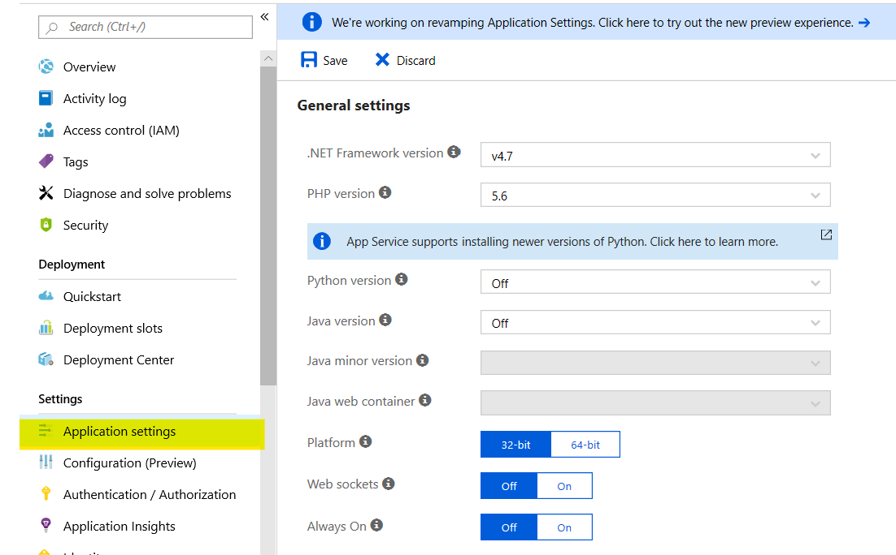
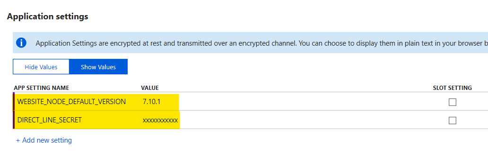

# 3. Configura *settings* en Azure
> [here for English document](Azure.settings.md)

1. Accede al portal de Azure y nevega al *App Service* donde has desplegado *GoogleAssitantProxy*.

2. Pincha en la opción *Application settings* en la sección *Settings*.

   
3. Baja hasta la sección *Application settings* y añade los siguientes valores:
   - **DIRECT_LINE_SECRET**: *key secret* del canal *Direct Line* de tu bot
   - **WEBSITE_NODE_DEFAULT_VERSION**: 7.10.1

   