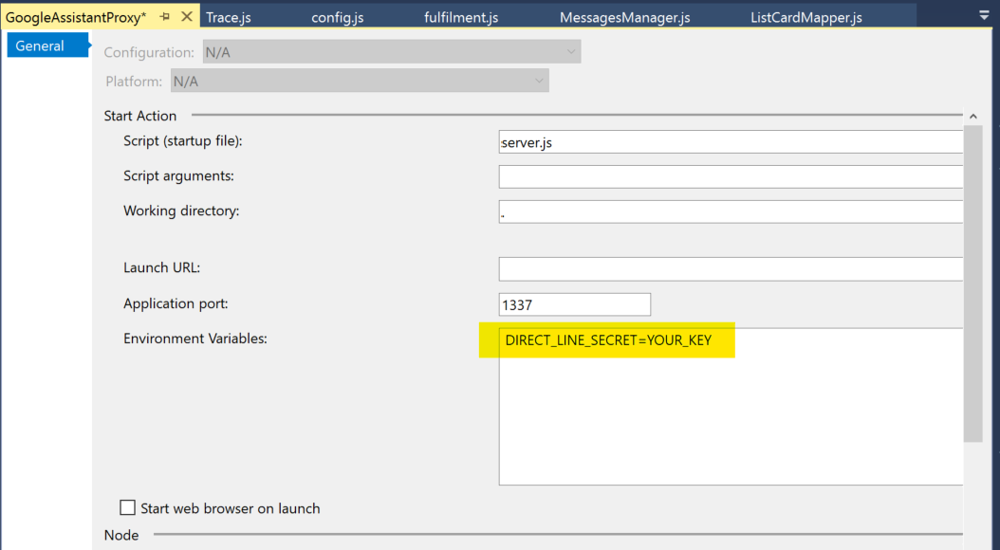
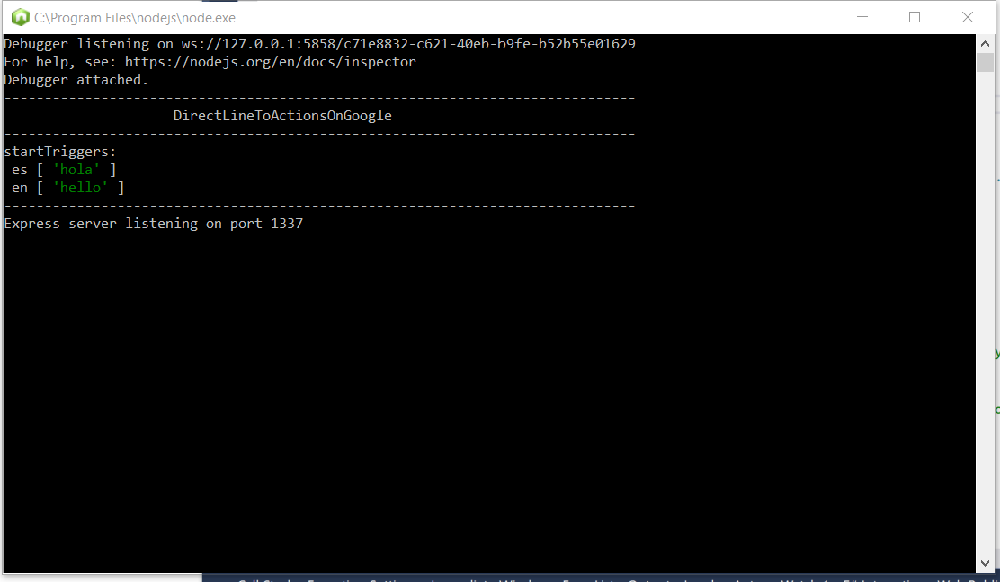
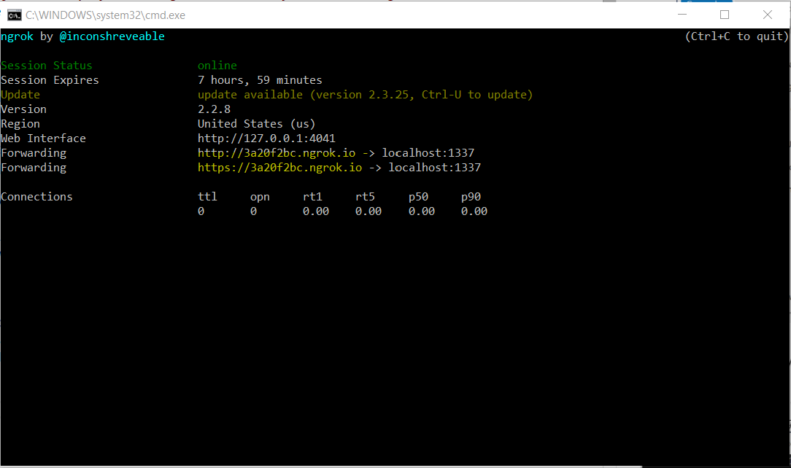

# Despliegue de *GoogleAssistantProxy* en local

Los pasos que debemos seguir para desplegar y probar en local son los siguientes:

## 1- Configura el *Direct Line Secret*.
Añade el settings ***DIRECT_LINE_SECRET*** con el *key secret* del canal *Direct Line* de tu bot.

Podemos hacerlo de dos formas:
- Directamente añadirlo en el fichero ***server.js*** del proyecto ***GoogleAssistantProxy***.
  ```javascript
  process.env.DIRECT_LINE_SECRET = 'YOUR_KEY'
   ```
- En las propiedades del proyecto ***GoogleAssistantProxy*** (recomendado).

  

## 2- Ejecutar el proyecto *GoogleAssistantProxy* en modo debug.
Te deberia abrir la consola de *node.js*  indicandote que se ha inicializado el *middelware* de *express* *directLineToActionsOnGoogle* (que es el otro proyecto ;-) ).



> Al inicializar nuestra librería, te muestra por consola los mensajes que has configurado.

## 3- Ejecutar *ngrog*
Ahora que tenemos nuestro proxy ejecutándose en un puerto local (por defecto el 1337), necesitamos que generar una url segura que nos redirija a nuestro puerto. Esto nos lo facilita [***ngrog***](https://ngrok.com/).

Para simplificar la configuración, he añadido el comando ***GoogleAssistantProxyLocalTest.cmd*** que directamente genera la url sobre el puerto 1337. Está en  Sólo tienes en la carperta *Deploy\Local* de la solución.



> Las urls que nos genera son las que aparacen en ***Forwarding***. Más concretamente la url segura https.


## 4. Configura las plantillas actions.json
Tenemos que actualizar las plantillas actions.json con la url https que nos ha generado *ngrog*.

> En la carpeta *Deployment/Local* hay a modo de ejemplo dos plantillas (una para inglés y otra para español).

otra para español).
   ```json
   {
    "locale": "es",
    "actions": [{
        "description": "<descripción>",
        "name": "MAIN",
        "fulfillment": {
            "conversationName": "MAIN_CONVERSATION"
        },
        "intent": {
            "name": "actions.intent.MAIN",
          "trigger": {
            "queryPatterns": [ "Hablar con <nombre de tu bot>", "Hola <nombre de tu bot>", "Quiero hablar con <nombre de tu bot>"]
            }
        }
    }],
    "conversations": {
      "MAIN_CONVERSATION": {
        "name": "MAIN_CONVERSATION",
        "url": "https://3a20f2bc.ngrok.io",
        "inDialogIntents": [
          {
            "name": "actions.intent.CANCEL"
          }
        ],
        "fulfillmentApiVersion": 2
      }
    }
}
   ```

Ahora solo queda continuar con los pasos de la [guía rápida](../readme.es-es.md).