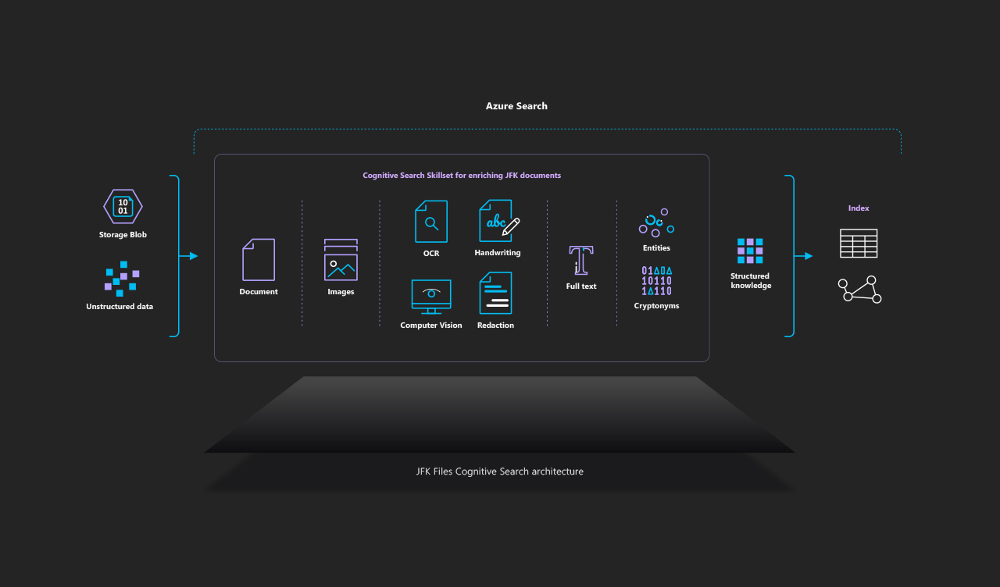
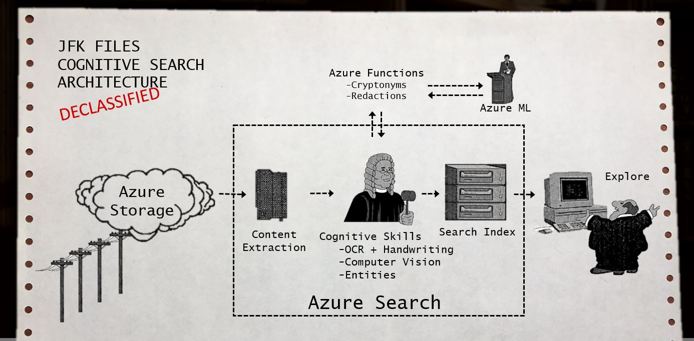

# The JFK Files
In 2017, the US government released over 34,000 pages of documents relating to the CIA investigation of the JFK assasination. These files contain a huge volume of unstructured data - typed and handwritten notes, photos and other data that standard search solutions are unable to parse.

This lab will show you how you can leverage AI and Cognitive Search, to extract meaning from this data.
You can watch a demo of the lab contents in action in a short [online video](https://channel9.msdn.com/Shows/AI-Show/Using-Cognitive-Search-to-Understand-the-JFK-Documents)
or explore the JFK files yourself with our [online demo](https://aka.ms/jfkfiles-demo).

## Cognitive Search - An AI-first approach to content understanding
Cognitive Search is an Azure service that ingests your data from almost any datasource; enriches it using a set of cognitive skills, and finally enables you explore the data using Azure Search.



## JFK Files Architecture
The JFK files example leverages the built-in Cognitive Skills inside of Azure Search and combines it with custom skills using extensibility.  The architecture below showcases how the new Cognitive Search capabilities of Azure enable you to easily create structure from almost any datasource.



Note: This diagram of visuals are inspired by the [CIA's JFK document management system in 1997](https://www.archives.gov/files/research/jfk/releases/docid-32404466.pdf) included in the JFK files.

This project includes the following capabilities for you to build your own version of the JFK files.
1. We have provided a small subset of the [JFK PDF documents](https://www.archives.gov/research/jfk/2017-release) and images that have been uploaded to the cloud into Azure Blob Storage.
2. An [Azure Search](https://azure.microsoft.com/en-us/services/search/) service is used to index the content and power the UX experience. We use the new Cognitive Search capabilities to apply pre-built cognitive skills to the content, and we also use the extensibility mechanism to add custom skills using [Azure Functions](https://azure.microsoft.com/en-us/services/functions/).
    1. Uses the [Cognitive Services Vision API](https://azure.microsoft.com/en-us/services/cognitive-services/computer-vision/) to extract text information from the image via OCR, handwriting, and image captioning,
    2. Applies Named Entity Recognition to extract named entities from the documents,
    3. Annotates text using a custom [CIA Cryptonyms](https://www.maryferrell.org/php/cryptdb.php) skill,
    4. Generates [HOCR content](https://en.wikipedia.org/wiki/HOCR) based on results.
3. A standalone website to search the index and explore the documents

## Limitations and Considerations
1. This is a lab to showcase a Cognitive Search use case.  It is not intended to be a framework or scalable architecture for all scenarios, though it can give you an idea of what your scenario might end up looking like.
2. The OCR technology is not perfect and the handwriting capability is in preview.  The results will vary greatly by scan and image quality.
3. Most file formats and datasources are supported, however some scanned and native PDF formats may not be parsed correctly.
4. Cognitive Search is currently only available in public preview in the South Central US and West Europe Azure regions, so the Azure Search service you use with this demo must be provisioned in one of these two regions.

## Setup your environment

### A) Setup your Azure subscription

This lab **requires** an Azure subscription. If you delete the resources at the end of the session, total charges will be less than $1 so we strongly recommend using an existing subscription if available.

If you need a new Azure subscription, then there are a couple of options to get a free subscription:

1. The easiest way to sign up for an Azure subscription is with VS Dev Essentials and a personal Microsoft account (like @outlook.com). This does require a credit card; however, there is a spending limit in the subscription so it won't be charged unless you explicitly remove the limit.
    * Open Microsoft Edge and go to the [Microsoft VS Dev Essentials site](https://visualstudio.microsoft.com/dev-essentials/).
    * Click **Join or access now**.
    * Sign in using your personal Microsoft account.
    * If prompted, click Confirm to agree to the terms and conditions.
    * Find the Azure tile and click the **Activate** link.
1. Alternatively, if the above isn't suitable, you can sign up for a free Azure trial.
    * Open Microsoft Edge and go to the [free Azure trial page](https://azure.microsoft.com/en-us/free/).
    * Click **Start free**.
    * Sign in using your personal Microsoft account.
1. Complete the Azure sign up steps and wait for the subscription to be provisioned. This usually only takes a couple of minutes.

### B) Install Postman
This lab uses Postman to interact with the Azure Search REST API. Other similar tools can be used e.g. Fiddler, Charles.
The free [Postman desktop app can be downloaded](https://www.getpostman.com/) and installed for most operating systems.
See the [Azure Search](https://docs.microsoft.com/en-us/azure/search/search-fiddler) documentation for more information on using Postman.

### C) Download the lab materials
Download the sample code provided for this lab, it includes the following:

  * Sample JFK file documents
  * JSON request files for configuring the Cognitive Search Service
  * A set of custom Cognitive skills
  * The frontend JFK search app

To Download:  

1. Click **Clone or download** from this repo.
1. You can clone the repo using git or click **Download ZIP** to directly download the code from your browser.


## Create a simple cognitive search pipeline

In this module, you'll learn how to create your own Cognitive Search pipeline. You'll use the 'OCR cognitive skill' to perform character recognition on the source documents.

### A) Create Azure resources

In order to speed up the lab we provide an Azure Template to deploy the required resources for this lab. The template will provision the following services:

  * An Azure Search service.
  * An Azure Blob Storage Account.
  * An Azure App Service plan.
  * An Azure Web App Service to deploy the front-end.
  * An Azure Function instance.

Follow the next steps to create the resources:

1. Click the following link to deploy the template: // TODO: Replace template url

    <a href="https://portal.azure.com/#create/Microsoft.Template/uri/https%3A%2F%2Fraw.githubusercontent.com%2FMicrosoft%2FAzureSearch_JFK_Files%2Fmaster%2Fazuredeploy.json" rel="nofollow">
     
    </a>

1. You will be redirected to Azure, provide your credentials to login.
1. Provide the required information:

    * Subscription: select your subscription.
    * Create a new resource group with the name: `ai-labs-<your initials>`.
    * Location: `South Central US`.

    > [!NOTE] At the time of writing, Azure Search with Cognitive Services is only available in the `South Central US` region.
1. Select the checkbox for *"I agree to the terms and conditions stated above"*.
1. Click **Purchase**. This step might take a few seconds.
1. Once the deployment is complete, you will see a **Deployment succeeded** notification.

Save the configuration values required to use these services:

1. Go to **Resource groups** in the left pane and **search** for your resource group: `jfk-labs-<your initials>`.
1. Click on the resource.
1. Click on **Deployments**.
1. Click on the Deployment Name **Microsoft.Template** from the first result.
1. Click on **Outputs**.
1. Copy all the values in Notepad.
  > [!NOTE] These settings are required to connect to the services later in the lab.

### B) Upload sample documents

We'll need a set of documents for testing the capabilities of cognitive search. Let's upload the sample files.

Create the blob container:

1. Go to **All Resources** in the left pane and **search** for the storage: `jfkstorage`.
1. Click on the resource.
1. Click on the **Blob** option.
1. Click on **+Container** and provide the required information:

    * Name: `jfkfiles`.
    * Public access level: `Container`.

1. Click on the newly created container.
1. Click the **Upload** button.
1. Select the following files from the lab materials: `resources\documents`.
1. Click **Upload** and wait for the process to complete.

### C) Create a Datasource

A data source is the mechanism by which Azure Search indexers ingest data. You can pull data from supported Azure data sources using indexers and schedule data refreshes of a target index. 

Setup Postman:

1. Open **Postman** from the Start Menu.
1. Click on **Import** from the toolbar.
1. Click on **Import files** and select the collection file at `resources\AI Labs - Azure Search.postman_collection.json`.
1. Click the gear icon in the upper right corner and select "Manage Environments".
1. Click the **Import** button at the bottom of the modal and select the file `resources\AI Labs - Azure Search.postman_environment.json`.
1. Click on the environment name to reveal a key-value editor to add, edit, and delete the environment variables.
1. Set the value of the following variables:

    * searchServiceName: paste the **SEARCH SERVICE NAME** value obtained in the deployment's output.
    * searchServiceKey: paste the **SEARCH SERVICE API KEY** value obtained in the deployment's output.

1. Click on **Update** and close the modal window.
1. Select `AI Labs - Azure Search` from the environment list in the top right corner.

Make the request:

1. Click the **Create Data Source** request from the collection.
1. Click on **Body** and specify the following values:

    * name: `jfklabds`.
    * type: `azureblob`.
    * credentials: set the **connectionString** using the Blob Storage account connection string obtained in the deployment's output.

1. Click on **Send** and wait for the response. If the request is successful you should see a status code `201 Created`.

### D) Create a simple skillset

A Skillset is a set of Cognitive Skills that are used to extract and enrich data from the source documents to make it searchable in Azure Search. The service provides a set of [predefined cognitive skills](https://docs.microsoft.com/en-us/azure/search/cognitive-search-predefined-skills) to extract data using techniques like entity recognition, language detection, key phrase extraction, text manipulation, and image detection, for more information follow this [link](https://docs.microsoft.com/en-us/azure/search/cognitive-search-concept-intro).

1. Click the **Create Skillset** request from the collection in **Postman**.
1. Review the request url and replace the value **[skillset_name]** with `jfklabskillset`.
1. Click on **Body** and check the value, it contains two predefined skills:

    * An OCR Skill to extract the text from printed content.
    * A Text Merger Skill to merge the textual representation from the OCR skill into the **finalText** field.

1. Click on **Send** and wait for the response. For a successful request, you should see status code `201 Created`.

### E) Create a document index

Creating an index specifies the schema and metadata that are required to store documents in Azure Search.

1. Click the **Create Index** request from the collection in **Postman**.
1. Review the request url and replace the value **[index_name]** with `jfklabindex`.
1. Click on **Body** and check the value, it contains the index definition.
  > [!NOTE] The body of the request contains the schema definition, which includes the list of data fields within documents that will be fed into this index.
1. Click on **Send** and wait for the response. For a successful request, you should see status code `201 Created`.

### F) Create an indexer

Indexers are specific to Azure data storage, they are used for crawling data in the data source and populating the Azure Search index. 

1. Click the **Create Indexer** request from the collection in **Postman**.
1. Review the request url and replace the value **[indexer_name]** with `jfklabindexer`.
1. Click on **Body** and replace the **[IndexerName]** with `jfklabindexer`.
1. Replace the following values:

    * [IndexName]: set the value of the index previously created (`jfklabindex`).
    * [DataSourceName]: set the value of the data source previously created (`jfklabds`).
    * [SkillSetName]: : set the value of the Skillset previously created (`jfklabskillset`).

1. Click on **Send** and wait for the response. For a successful request, you should see status code `201 Created`.

### G) Verify

1. Return to the [Azure Portal](https://portal.azure.com).
1. Go to **All Resources** in the left pane and **search** for the Search resource: `jfk-lab-search-service`.
1. **Click** on the resource. This will provide an overview of the service, from this view you can access the indexes, indexers, data sources and perform other operations on the service.
1. Click on **Indexers** and check the status of your newly created Indexer, wait for the status to be **Success**. This process might take a few minutes to complete.
1. Return to the Search service overview.
1. Click the **Search Explorer** from the toolbar.
1. In the search box type: `$top=10&$count=true`.
1. Click the **Search** button. You will see the 7 documents that we initially uploaded to the storage, and the content of the documents in the **text** field.
1. On the search box displayed type: `JFK&$count=true`.
1. Click the **Search** button.
1. Review the results and look for the text that matches your search criteria. The service will retrieve 5 documents for this query.
  > [!NOTE] Use `CTRL+F` to search through the document content if you can't find the content that matches your query.


## Create a custom cognitive skill

In this module, you'll learn how create a custom skill that can be plugged into the Cognitive Search pipeline.
Building a custom skill gives you a way to insert specific transformations to your content and apply whatever enrichment process you require.
In this example we will create a custom skill that annotates documents that contain CIA "Cryptonym" code words. e.g The CIA assigned the cryptonym `GPFLOOR`to Lee Harvey Oswald, so any documents containing that Cryptonym will be linked with Oswald.

### A) Create an Azure Function

The only requirement for a skill is the ability to accept inputs and emit outputs. Currently, the only mechanism for interacting with a custom skill is through a Web API interface. Although this example uses an Azure Function to host a web API, it is not required as long as you meet the interface requirements for a cognitive skill. Click [here](https://docs.microsoft.com/en-us/azure/search/cognitive-search-custom-skill-interface#web-api-custom-skill-interface) for more information.

1. Open **Visual Studio** from the Start Menu.
1. Click **Open Project/Solution** and select `JfkWebApiSkills\JfkWebApiSkills.sln`.
1. Right-click the Solution.
1. Click **Restore NuGet Packages**.
1. Open the file `JfkWebApiSkills`.
1. Add the following function method.
```
[FunctionName("link-cryptonyms")]
public static IActionResult RunCryptonymLinker([HttpTrigger(AuthorizationLevel.Function, "post", Route = null)]HttpRequest req, TraceWriter log, ExecutionContext executionContext)
{
}
```
7. Add the following code snippet to the function method to get the input records:
```
string skillName = executionContext.FunctionName;

// Get the batch of input records from the request
var requestRecords = WebApiSkillHelpers.GetRequestRecords(req);
if (requestRecords == null)
{
    return new BadRequestObjectResult($"{skillName} - Invalid request record array.");
}
```
8. Add the following code at the end of the method, this will process all the records and put the results in the output:
```
// Process each record and set the cryptonym to the output if found
WebApiSkillResponse response = WebApiSkillHelpers.ProcessRequestRecords(skillName, requestRecords,
    (inRecord, outRecord) => {
        string word = inRecord.Data["word"] as string;
        if (word.All(Char.IsUpper) && cryptonymLinker.Cryptonyms.TryGetValue(word, out string description))
        {
            outRecord.Data["cryptonym"] = new { value = word, description };
        }
        return outRecord;
    });

return (ActionResult)new OkObjectResult(response);
```
> [!NOTE] The `ProcessRequestRecords` method sets the description of each cryptonym, it reads the values from the json file `CryptonymLinker\cia-cryptonyms.json`. Open this file to see the list of available cryptonyms.

### B) Deploy to Azure from Visual Studio

For the purposes of our demo, we'll be deploying directly from Visual Studio.

1. Check your current connected account in the top right corner of **Visual Studio**.
  > [!ALERT] Ensure you are signed in with the same credentials you used to sign in to Azure. This will connect Visual Studio to your Azure subscription.
1. Select **JfkWebApiSkills** from the Projects dropdown list in the toolbar.
1. Select `Release`.
1. Right-click the **JfkWebApiSkills** project.
1. Click **Build** and wait for it to finish.
1. Right-click the **JfkWebApiSkills** project.
1. Click **Publish**.
1. Mark the option Select Existing.
1. Click **Publish**.
1. Select the Web App previously created for the function: `jfk-lab-function-app`.
1. Click **OK** and wait for the deployment to complete. This step might take a few minutes.
  > [!NOTE] If you are prompted to update the Functions Version on Azure click **Yes**.
1. Check the **Output** window until you see the **Publish completed** message.
1. In the Azure portal, search for your function app resource: : `jfk-lab-function-app`.
1. Click on **Function app settings**.
1. Select the **Copy icon** for the **master** host key. Paste this value in Notepad as you'll need it later.
1. Click on the **Platform features** option.
1. Click on **SSL**.
    > [!NOTE] All Azure Functions created after June 30th, 2018 have disabled TLS 1.0, which is not currently compatible with custom skills.
1. After selecting SSL, ensure the **Minimum TLS version** is set to 1.0.
  > [!ALERT] TLS 1.2 functions are not yet supported as custom skills.
1. Click on the **Overview** option.
1. Click on **Configuration**.
1. Click on **+ New Application Settings Verify** and add the following setting:

    * name: `MSDEPLOY_RENAME_LOCKED_FILES`.
    * value: `1`.

1. Scroll to the top and click the **Save** button.

### C) Test the Function

1. Return to **Postman**.
1. Click the **Test Custom Skill** request from the collection in **Postman**.
1. Review the request url and replace the following values:

    * **[function_app_name]** with the `AZURE FUNCTION SITE NAME` value from the initial Deployment Output.
    * **[function_host_key]** with the Host key previously obtained.

1. Click on **Body** and check the content, we'll be sending 2 cryptonyms to the function.
1. Click on **Send** and wait for the response. For a successful request, you should see status code `200 OK`.
1. Check the descriptions for each cryptonym in the response body.

### D) Connect the custom skill to your pipeline

1. Click the **Create Skillset** request from the collection in **Postman**.
1. Review the request url and replace the value **[skillset_name]** with `jfklabskillset`.
1. Click on the **Body** and add the new skill to the end of the skills array:
```
{
  "@odata.type": "#Microsoft.Skills.Custom.WebApiSkill",
  "description": "Cryptonym linker",
  "uri": "https://[function_app_name].azurewebsites.net/api/link-cryptonyms?code=[default_host_key]",
  "context": "/document/normalized_images/*/layoutText/words/*/text",
  "inputs": [
      {
          "name": "word",
          "source": "/document/normalized_images/*/layoutText/words/*/text"
      }
  ],
  "outputs": [
      {
          "name": "cryptonym",
          "targetName": "cryptonym"
      }
  ]
}
```
> [!NOTE] Replace the `[function_app_name]` and `[default_host_key]` with the values used in the previous section.
1. Click on **Send** and wait for the response. For a successful request, you should see status code `204 No Content`.
1. Click the **Get Skillset** request from the collection in **Postman**.
1. Review the request url and replace the value **[skillset_name]** with `jfklabskillset`.
1. Click on **Send** and wait for the response. Check the response and search for the newly added skill in the results.

Include the cryptonyms field in the Indexer:

1. Click the **Create Indexer** request from the collection.
1. Add the following code snippet to the `outputFieldMappings` section:
```
{
    "sourceFieldName": "/document/normalized_images/*/layoutText/words/*/text/cryptonym/value",
    "targetFieldName": "cryptonyms"
}
```
1. Click on **Send** and wait for the response.

### E) Run the Indexer

We have to re-run the indexer to apply the new skill to the source documents.

1. Go to **All Resources** in the left pane and **search** for the Search resource: `jfk-lab-search-service`.
1. **Click** on the resource. This will provide an overview of the service, from this view you can access the indexes, indexers, data sources and perform other operations on the service.
1. Click on **Indexers** and check the status of the newly created Indexer, wait for the status to be **Success**. This process might take a few minutes to complete.

### F) Verify

1. Return to the [Azure Portal](https://portal.azure.com).
1. Go to **All Resources** in the left pane and **search** for the Search resource: `jfk-lab-search-service`.
1. **Click** on the resource.
1. Click on **Indexers** and click on the first indexer displayed.
1. Click the **Run** button, it will prompt for confirmation, click **Yes**.
1. Return to the Search service overview.
1. Click the **Search Explorer** from the toolbar.
1. On the search box displayed type: `WILSON&$count=true`.
1. Click the **Search** button.
1. Review the results and look for the `cryptonyms` field, you will see the **AM** cryptonym in the results.

## Create an advanced cognitive search pipeline

In this module, you'll create a more advanced pipeline, using the custom skill from the previous module and include more cognitive skills in the pipeline.

### A) Review documents data

Let's take a look at our source data and see which data is not being extracted:

1. Go to your lab directory and open the document at `resources\documents\104-10013-10234.pdf`.
1. Notice the handwritten text at the bottom.
1. Go back to the **Search explorer** in Azure.
1. On the search box displayed type: `FBI`.
1. Click the **Search** button.
1. Try finding the **104-10013-10234** in the results, you will see that it is not being recognized by our current skillset.
1. Go to your lab directory and open the document at `resources\documents\photo_oswald.jpeg`.
1. On the search box displayed type: `oswald`.
1. Click the **Search** button.
1. Try finding the picture file in the results, you will see that is not being recognized either.

### B) Create a Search Query Key

We'll use a **query key** to query the Search service from the front-end. Query keys grant read-only access to indexes and documents, and are typically distributed to client applications that issue search requests. In the next steps we'll create a new query key. You can create up to 50 query keys per service.

1. Follow this [link](https://docs.microsoft.com/en-us/rest/api/searchmanagement/querykeys/create) to create the query key.
1. Login with the same credentials you used to sign in to Azure.
1. Review the request url and provide the following parameters:

    * **subscriptionId**: copy the value from the initial deployment output.
    * **resourceGroupName**: your resource group name.
    * **searchServiceName**: copy the value from the initial deployment output.
    * **name**: `my_query_key`.

1. Click on **Run**.
1. Check the response body, copy the **key** value as you will need it later.

### C) Create advanced pipeline components

In order to speed up the lab process we'll use a console app to recreate the different components in the pipeline. This will include more cognitive skills like handwritting and image analysis for categories, faces, image type, adult content and others.

1. Return to **Visual Studio**.
1. Open the file `App.config` from the `JfkInitializer` project..
1. Add the configuration values, use the values obtained in previous steps.
1. Open the `Program.cs` file.
1. Go to the `CreateAdvancedPipelineAsync` method.
1. Check the list of components being re-created.

    * Skillset
    * Index
    * Indexer
    * Synonyms: this is a map that you define and upload to your service to define synonyms. These map constitute an independent resource (like indexes or data sources), and can be used by any searchable field in any index in your search service.
    * Blob Container for image store: used to store annotations from image data.

1. Let's implement the synonyms map, go to the method `CreateSynonyms`.
1. Add the following code snippet where indicated:
```
try
{
    SynonymMap synonyms = new SynonymMap(SynonymMapName, SynonymMapFormat.Solr,
        @"GPFLOOR,oswold,ozwald,ozwold,oswald
          silvia, sylvia
          sever, SERVE, SERVR, SERVER
          novenko, nosenko, novenco, nosenko");
    await _searchClient.SynonymMaps.CreateAsync(synonyms);
}
catch (Exception ex)
{
    Console.WriteLine("Error creating synonym map: {0}", ex.Message);
    return false;
}
```
1. Right click on the `JfkInitializer` project and click **Debug > Start new instance**.
  > [!NOTE] Click **Continue Debugging (Don't ask again)** if prompted.
1. A console window will be opened, it will display the process output.

### D) Add more custom skills

1. Open the file explorer in the lab materials directory and replace the following files:

    * Copy `resources\advanced-pipeline\JfkWebApiSkills.cs` to `src\JfkWebApiSkills\JfkWebApiSkills`.
    * Copy `resources\advanced-pipeline\cia-cryptonyms.json` to `src\JfkWebApiSkills\JfkWebApiSkills\CryptonymLinker`.

1. Replace the file and open it in **Visual Studio**. The file contains the following functions:

    * facet-graph-nodes.
    * link-cryptonyms: the custom skill created in previous section.
    * link-cryptonyms-list: similar to the previous skill but returns a list of cryptonyms per word.
    * image-store: uploads image data to blob storage.
    * hocr-generator: transforms ocr metadata to the hocr open standard (data representation for formatted text obtained from OCR).

1. Right-click the **JfkWebApiSkills** project.
1. Click **Rebuild** and wait for it to finish.
1. Right-click the **JfkWebApiSkills** project.
1. Click **Publish**.
1. Click **Publish** again.
1. Review the deployment result in the **Output** window and wait for the operation to complete.
  > [!Note] If your deployment fails due **ERROR_FILE_IN_USE**, return to Azure and open your function app resource, click **Restart** from the **Overview** page and try the deployment again.

### E) Deploy front-end

1. Go to the `Main` method.
1. Replace the following line: `bool result = CreateAdvancedPipelineAsync().GetAwaiter().GetResult();`

    with

    `bool result = DeployFrontEndAsync().GetAwaiter().GetResult();`

1. Right click on the `JfkInitializer` project and click **Debug > Start new instance**.
1. It will open a Console App, wait until it requests to build the Website.
1. Open a **Terminal** and navigate to the `frontend` directory in you lab folder.
1. Execute the following commands:

    * `npm install`
    * `npm run build:prod`
    > [!NOTE] Check that a **dist** folder was created in your **frontend** directory.
1. Return to the Console App and press any key to continue.
1. Wait for deployment to complete, this might take a few seconds.
1. Copy the **Website url** and press any key to finish.

### F) Verification

1. Open the **Website url** in a Browser.
1. Search `ozwold`.
1. Click the **Search** button.
1. Check the results and see the picture recognized as Oswald, this is done by using the Image Analysis (Computer Vision) skill.
  > [!NOTE] Notice how the Synonyms map allows to match the **ozwold** word to **oswald**.
1. Review the list of entities at the left pane.
1. Click on **FBI**, you will see 2 results containing that entity.
1. Click on the first document, you will be able to see the document details.
1. Search the **FBI** word on the right pane, see how we can highlight the word in the original document using the image metadata.
1. Change the search criteria and search for `FBI`.
1. Click the **Search** button.
1. Click on the document **104-10013-10234**.
1. Review how the pipeline is extracting the **FBI** word from handwritten text.
