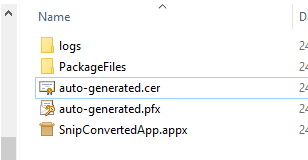
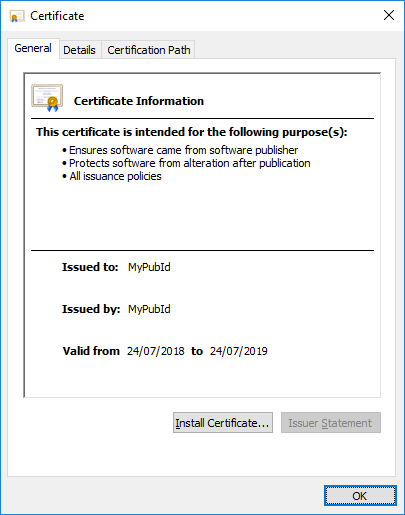
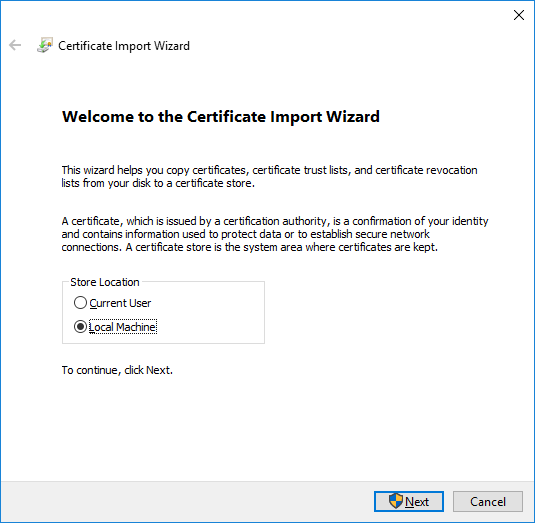
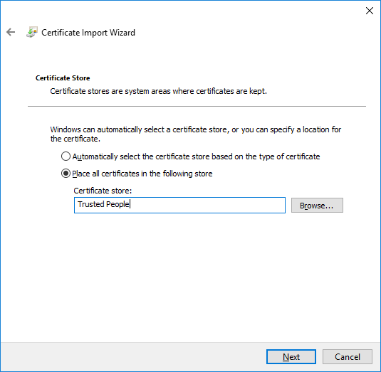
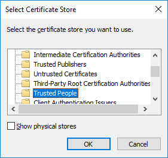
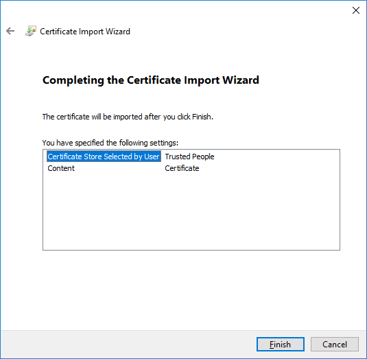

## Install Certificate

The certificate must be installed in order to deploy the application in PC.
You can install the certificate by double clicking the .cer file and selecting the "Install Certificate..." option:

Select Local Machine (You will need Administrator Rights):

Click Browse to select the place to install the certificate:

We are going to install the certificate in the Trusted People folder:

Complete the import wizard by clicking on the Finish button:

